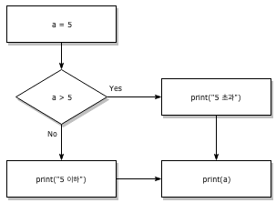
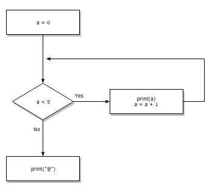
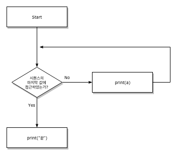
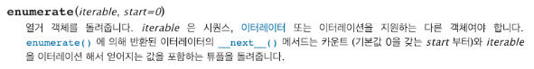

# 2019/01/03

## python 기초

### **조건문**

```python
# 위의 flow chart로 표현하면 아래와 같다.
a = 5
if a > 5:
    print("5 초과")
else:
    print("5 이하")
print(a)

5 이하
5
```




#### **조건문 문법**

1. `if` 문은 반드시 일정한 참/거짓을 판단할 수 있는 `조건식`과 함께 사용이 되어야한다. `if <조건식>:`

2-1. `<조건식>`이 참인 경우 `:` 이후의 문장을 수행한다.

2-2. `<조건식>`이 거짓인 경우 `else:` 이후의 문장을 수행한다.

- 이때 반드시 **들여쓰기를** 유의해야한다. 파이썬에서는 코드 블록을 자바나 C언어의 `{}`와 달리 `들여쓰기`로 판단하기 때문이다.
- 앞으로 우리는 `PEP-8`에서 권장하는 `4spaces`를 사용할 것이다.

##### 코드

```python
# 실습문제1
# 조건문을 통해 변수 num의 값과 홀수/짝수 여부를 출력하세요.

# 실습! 아래에 코드를 작성하세요.
num = int(input("점수를 입력하세요 : "))
# input(출력 문구) -> 사용자의 입력을 받는다.
if num % 2 == 0:
    print("짝수입니다")
else :
    print("홀수입니다")
    
점수를 입력하세요 : 5
홀수입니다

# 실습문제2
# 아래 코드의 출력 결과를 예상해보세요

#코드는 다음과 같습니다. 출력 결과를 예상해보세요. 
if True:
    if False:
        print("1")
        print("2")
    else:
        print("3")
else:
    print("4")
print("5")

# 예상	# 결과
  3			3
  5			5

# if 문 후에 아무 것도 실행하고 싶지 않으면 pass를 쓴다.

# 실습문제 3
# 호날두는 5,000원의 돈을 가지고 있고 카드는 없다고 한다. 이러한 호날두의 상태는 아래와 같이 표현할 수 있을 것이다. 호날두는 택시를 타고 목적지까지 가려고 한다. 목적지까지 가기 위해서는 카드를 소유하고 있거나 4,000원 이상의 현금을 가지고 있어야 한다고 한다. 호날두는 택시를 탈 수 있는지를 판별할 수 있는 조건식을 작성하고 그 결과를 출력하세요.

# 여기에 코드를 작성하세요
Ronaldo = {"Card" : False, "Money" : 5000}
if Ronaldo["Card"] or Ronaldo["Money"]>=4000 :
    print("호우!")
else :
    print("우우!")
 
호우!
```

#### **복수 조건문**

2개 이상의 조건문을 활용할 경우 `elif <조건식>:`을 활용한다.

##### 코드

```python
# 조건문을 통해 변수 score에 따른 평점을 출력하세요.

#점수	등급
#90점 이상	A
#80점 이상	B
#70점 이상	C
#60점 이상	D
#60점 미만	F

# 실습!
score = int(input("점수를 입력하세요 : "))
# 아래에 코드를 작성하세요.
if score >= 90:
    print("A")
elif score >= 80:
    print("B")
elif score >= 70:
    print("C")
elif score >= 60:
    print("D")
else:
    print("F")
    
점수를 입력하세요 : 70
C

# 실습문제2
# 다음 코드의 결과값을 예측하세요

a = "Life is too short, you need python"

if 'wife' in a:
    print('wife')
elif 'python' in a and 'you' not in a:
    print('python')
elif 'shirt' not in a:
    print('shirt')
elif 'need' in a:
    print('need')
else:
    print('none')

# 예상	#결과
shirt	 shirt

# 실습문제3
# 다음 소스 코드를 완성하여 1부터 100까지의 숫자를 출력하면서 2의 배수일 때는 'Fizz', 11의 배수일 때는 'Buzz', 2와 11의 공배수일 때는 'FizzBuzz'가 출력되게 만드세요.

#여기에 코드를 입력하세요.
for i in range(1,101):
    if i % 2 == 0 and i % 11 == 0:
        print(str(i) + "FizzBuzz")
    elif i % 2== 0:
        print(str(i) + "Fizz")
    elif i % 11 == 0:
        print(str(i) + "Buzz")
    else:
        print(i)
        
# 실습문제4
# 세 정수 A, B, C가 주어진다. 이때, 두 번째로 큰 정수를 출력하는 프로그램을 작성하세요.

# 여기에 코드를 입력하세요

num = []
num.append(int(input("a")))
num.append(int(input("b")))
num.append(int(input("c")))

num.sort()
print(num[1])

# 선생님 코드
a, b, c = map(int, input().split())
# input으로 받으면 "1 2 3" -> split() [1,2,3] str형
# map() -> [int("1"), int("2"), int("3")]

if((a>=b and b>=c)or (c>=b and b>=a)):
    print(b)
elif((b>=c and c>=a) or(a>=c and c>= b)):
    print(c)
else:
    print(a)
    
# split 공백을 기준으로 문자열을 나누어 주는 함수
# map 이미 정의된 함수에 list, dictionary, tupe 같은 iterable한 데이터를 인자로 받아 list 안의 개별 item을 함수의 인자로 전달하여 결과를 list 형태로 반환해주는 함수
# iterable의 의미는 member를 하나씩 차례로 반환 가능한 object를 말한다.
    
# 실습문제5
# 사용자로부터 달러, 엔, 유로, 또는 위안 금액을 입력받은 후 이를 원으로 변환하는 프로그램을 작성하세요. 각 통화별 환율은 다음과 같습니다. 사용자는 100 달러, 1000 엔, 13 유로, 100 위안과 같이 금액과 통화명 사이에 공백을 넣어 입력한다고 가정합니다.

#코드는 여기에 작성하세요
currency = input("돈을 입력하세요 (ex: 10 달러, 5 유로)")
won = int(currency.split()[0])

if '달러' in currency:
    won *= 1126.3
    print(currency + "는 " + str(won)+"원입니다.")
elif '엔' in currency:
    won *= 10.46
    print(currency + "는 " + str(won)+"원입니다.")
elif '유로' in currency:
    won *= 1277.67
    print(currency + "는 " + str(won)+"원입니다.")
elif '위안' in currency:
    won *= 163.52
    print(currency + "는 " + str(won)+"원입니다.")
else:
    print("이건 안 바꿔줘요 ㅠㅠ")

돈을 입력하세요 (ex: 10 달러, 5 유로)10 유로
10 유로는 12776.7원입니다.
```

& = and 이나 양 쪽의 조건 모두를 확인하기 때문에 비효율적이다.

#### **조건 표현식**

##### **활용법**

```
true_value if <조건식> else false_value
```

와 같이 표현식을 작성할 수 있다. 이는 보통 다른 언어에서 활용되는 삼항연산자와 동일하다.

##### 코드

```python
# 아래의 코드는 무엇을 위한 코드일까요?
num = int(input("숫자를 입력하세요 : "))
value = num if num >= 0 else 0
print(value)

# 위의 코드와 동일한 코드입니다.
num = int(input("숫자를 입력하세요 : "))
if num >= 0:
    print(num)
else:
    print(0)

# 다음의 코드와 동일한 조건 표현식을 작성해보세요.
num = 2
if num % 2:
    result = '홀수입니다.'
else:
    result = '짝수입니다.'
print(result)

# 여기에 코드를 작성하세요.
num = 2
result = '홀수입니다.' if num % 2 else '짝수입니다'
print(result)

# 영어 이름은 미들 네임을 가지고 있는 경우가 있습니다.
# 영어 이름을 입력 받아 가운데 이름은 축약해서 나타내는 코드를 작성해보세요.

# 내 코드
name = input("Input your name.").split()

for i in name:
    if i == name[0] or i == name[-1]:
        print(i,end = " ")
    else :
        print(i[0] +".",end = " ")
        
# 선생님 코드
name = input()
names = name.split()
for i in range(1, len(names) -1): # python range(1,1) 쌉가능..
    print(names[i])
    names[i] = names[i][0] + '.'
print(' '.join(names)) # names 원소들을 합칠 때 중간에 ' '를 삽입한다.
# join
#Return a string which is the concatenation of the strings in iterable. A TypeError will be raised if there are any non-string values in iterable, including bytes objects. The separator between elements is the string providing this method.
# iterable 객체
# list, dict, set, str, bytes, tuple, range
```

### **반복문**

#### while 문

`while`문은 조건식이 참(True)인 경우 반복적으로 코드를 실행합니다. 

**while 문은 종료조건을 반드시 설정해주어야 한다.**



```python
a = 0
while a<5:
    print(a)
    a += 1
print("끝")
```

#### for 문

`for`문은 정해진 범위 내(시퀀스)에서 순차적으로 코드를 실행합니다.



##### 코드

```python
# 실습 문제0
# 1부터 1000까지의 자연수 중 5의 배수에 해당되는 자연수들의 총합을 구하세요.

#여기에 코드를 작성하세요 1 
del sum # sum() 내장함수니까 쓰지말자! 헷갈림 주의!!!!!
result = 0
for i in range(1,1001):
    if i % 5 == 0:
        result += i
print(result)

#여기에 코드를 작성하세요 2
result = []

for i in range(1,1001):
    if i% 5 == 0:
        result.append(i)
print(sum(result))

# 실습 문제1
# 반복문과 조건문만 활용하여 1~30까지 숫자 중에 홀수만 담긴 리스트를 만드세요

# 여기에 코드를 작성하세요.
odd = []
for i in range(1,31):
    if i % 2 == 1:
        odd.append(i)
print(odd)

#while 연습문제
# 1. 1부터 100까지 자연수를 모두 더하고 그 결과를 출력하세요.
# 여기에 코드를 작성하세요.
i = 1
sum = 0
while i <= 100:
    sum += i
    i += 1
print(sum)

sum = 0
for i in range(1,101):
    sum += i
print(sum)

# 2. 1부터 1000까지 자연수 중 3의 배수의 합을 구하세요.
i = 1
sum = 0
while i <= 1000:
    if i % 3 == 0:
        sum += i
    i += 1
print(sum)

# 3. 다음은 A학급 학생들의 수학 점수 리스트입니다. 다음 리스트에서 50점 이상의 점수들의 총합을 구하세요. for문과 while문을 각각 활용해서 2개의 답을 작성해주세요.
scores = [20,55,67,82,45,33,90,87,100,25]
result = 0
for i in scores:
    if i >= 50:
        result += i
print(result)

i = 0
result = 0
while i < len(scores):
    if scores[i] >= 50:
        result += scores[i]
    i += 1
print(result)

# 선생님 코드
result = 0
while scores:
    picker = scores.pop()
	#list.pop([i])
    #리스트에서 주어진 위치에 있는 항목을 삭제하고, 그 항목을 돌려줍니	   다. 인덱스를 지정하지 않으면, a.pop() 은 리스트의 마지막 항목을      삭제하고 돌려줍니다. 
    if picker >= 50:
        result += picker
print(result)

# 4. while 문을 활용하여 아래와 같은 역삼각형의 asterisk를 출력하는 코드를 작성하세요.
# *******
#  *****
#   ***
#    *

# 내 코드
n = 7
temp = []
i = 0
j = 1
while i <= n/2:    
    while j <= n:
        if j > i and j <= n-i:
            temp.append("*")
        else:
            temp.append(" ")
        j += 1
    print(''.join(temp))
    temp = []
    j = 1
    i += 1

# 선생님 코드
star = 7
space = 0

while star > 0:
    print(' ' * space + '*'*star)
    space += 1
    star -= 2

# 5. 0과 73 사이의 숫자 중 3으로 끝나는 숫자만 출력되게 하는 코드를 작성하세요.

# 내 코드
i = 0
while i <= 73:
    if str(i)[-1] == '3':
        print(i)
    i += 1

# 실습 문제2
# n이 입력으로 주어졌을 때, 1부터 n까지 합을 구하는 프로그램을 작성하세요.

# 여기에 코드를 작성하세요 
n = int(input("n을 입력해주세요."))
sum = 0
for i in range (1, n+1):
    sum += i
print(sum)

# 실습 문제3
# for와 range 함수를 이용하여 구구단 결과를 출력하세요.

# 여기에 코드를 작성하세요
for i in range(1,10):
    for j in range(1,10):
        print(i*j, end = ' ')
    print()

# 실습 문제4
# 표준 입력으로 삼각형의 높이가 입력됩니다. 입력된 높이만큼 산 모양으로 별을 출력하는 프로그램을 만드세요. 모양이 같더라도 공백이나 빈 줄이 더 들어가면 틀린 것으로 처리됩니다.

# 선생님 코드
height = int(input('산의 높이는?: '))
for i in range(height):
    for j in reversed(range(height)):
        if i<j:
            print(' ', end='')
        else:
            print('*', end='')
    for j in range(height):
        if i > j:
            print('*', end='')
    print()

# 내 코드
h = int(input("높이를 입력해주세요."))
space = h
star = 1
for i in range(1,h+1):
    print(" "*space + "*" * star)
    space -= 1
    star += 2
    
# 내 방식
temp = []
for i in range(h):
    for j in range(2*h):
        if j >= h-i and j <= h+i:
            temp.append('*')
        else:
            temp.append(' ')
    print(''.join(temp))
    temp = []
```

#### index와 함께 for문 활용하기

`enumerate()`를 활용하면, 추가적인 변수를 활용할 수 있다.

`enumerate()`는 [파이썬 표준 라이브러리의 내장함수](https://docs.python.org/ko/3.6/library/functions.html) 중 하나이며, 다음과 같이 구성되어 있다.



##### 코드

```python
classroom = ["kim","choi","lee"]
list(enumerate(classroom))

[(0, 'kim'), (1, 'choi'), (2, 'lee')]

list(enumerate(classroom, start = 1))

[(1, 'kim'), (2, 'choi'), (3, 'lee')]

# 실습문제1 - enumerate 활용
# colors = ['Apple', 'Banana', 'Coconut', 'Deli', 'Ele', 'Grape'] 다음 리스트에서 0번째 4번째 5번째 요소를 지운 새로운 리스트를 생성하시오.

#코드를 여기에 작성하세요. 
colors = ['Apple','Banana','Coconut','Deli','Ele','Grape']
fruit = [color for (a, color) in enumerate(colors) if a not in (0,4,5)]
print(fruit)

['Banana', 'Coconut', 'Deli']
```

#### dictionary 반복문 활용하기

```python
classroom = {"teacher" : "kim", "student1":"Hong","student2":"Kang"}

for member in classroom:
    print(classroom[member])

kim
Hong
Kang  
```

##### dictionary에서 `for` 활용하는 4가지 방법

```python
# 0. dictionary (key 반복)
for key in dict:
    print(key)

# 1. key 반복
for key in dict.keys():
    print(key)

# 2. value 반복    
for val in dict.values():
    print(val)

# 3. key와 value 반복
for key, val in dict.items():
    print(key, val)
```

#### **break, continue, else**

##### break

`break`문은 반복문을 종료하는 표현입니다

```python
# 실습문제
# 조건문과 반복문, break를 통해서 아래의 코드와 동일한 코드를 작성하세요.
# (3이 있을 경우 True를 print하고, 아닐 경우 False를 print 합니다.)

numbers = [1, 5, 10]
# 여기에 코드를 작성하세요.
print(3 in numbers)

result = False
for i in numbers:
    if i == 3:
        result = True
        break
print(result)
```

##### continue

`continue`문은 continue 이후의 코드를 수행하지 않고 다음 요소를 선택해 반복을 계속 수행합니다.

```python
for i in range(6):
    if i % 2 == 0:
        continue
    
    print(f'{i}는 홀수')
    
1는 홀수
3는 홀수
5는 홀수
```

##### else

`else`문은 끝까지 반복문을 시행한 이후에 실행됩니다.

(`break`를 통해 중간에 종료되지 않은 경우만 실행)

```python
for i in range(3):
    if i == 3:
        print(f'{i}에서 break')
        break

else:
    print("break 시행안됨")
    
break 시행안됨

for i in range(4):
    if i == 3:
        print(f'{i}에서 break')
        break

else:
    print("break 시행안됨")
    
3에서 break
```

### 연습 문제

#### 1번

```python
# 1부터 100까지 자연수를 각각 제곱해 더한 값인 '제곱의 합'과 1부터 100을 먼저 더한 다음에 그 결과를 제곱한 '합의 제곱'의 차이를 구하는 코드를 작성하세요.

#코드는 여기에 작성하세요

sum_of_power = 0
power_of_sum = 0

for i in range(1,101):
    sum_of_power += i**2
    power_of_sum += i
    
power_of_sum **= 2

print(sum_of_power)
print(power_of_sum)

print(abs(sum_of_power - power_of_sum))
```

#### 2번

```python
# 문자열 요소로만 이루어진 다음과 같은 리스트를 넣었을 때 (samples = ['level', 'asdwe', 's', 'abceda', 'gsdwrtfg']my), 문자열 길이가 2 이상이고 주어진 문자열의 첫번째와 마지막 문자가 같은 문자열의 수를 세는 코드를 작성하세요.

#코드는 여기에 작성하세요.
samples = ['level','asdwe','s','abceda','gsdwrtfg']
words = []

for i in samples:
    if len(i) >= 2 and i[0] == i[-1]:
        words.append(i)
        
print(len(words))
```


#### 3번

```python
# items = [10,20,40,20,10,30,50,60,40,80,50,40,20,30,10] 다음 리스트에서 중복된 요소를 제거한 리스트를 출력하세요.

#코드는 여기에 작성하세요.
items = [10,20,40,20,10,30,50,60,40,80,50,40,20,30,10]
result = list(set(items))
print(result)
```


#### 4번

```python
# colors = ['Apple', 'Banana', 'Coconut', 'Deli', 'Ele', 'Grape']다음 리스트에서 0번째 4번째 5번째 요소를 지운 새로운 리스트를 생성하세요. (위의 예제에서 사용했던 enumerate 메소드가 아닌 다른 방법들을 사용해서 자유롭게 풀어보세요)

colors = ['Apple', 'Banana', 'Coconut', 'Deli', 'Ele', 'Grape']


#코드를 여기에 작성하세요1
result = []

for i in colors:
    if i != colors[0] and i != colors[4] and i != colors[5]:
        result.append(i)
print(result)

#코드를 여기에 작성하세요2
fruit = []

for color in colors:
    if colors.index(color) not in (0,4,5):
        fruit.append(color)
print(fruit)

#코드를 여기에 작성하세요3
delete_index = [0,4,5]
fruit = []

for i in range(0,len(colors)):
    if i not in delete_index:
        fruit.append(colors[i])
print(fruit)
```


#### 5번

```python
# 아래의 문자열을 분석하여 나이가 30미만이고 키가 175이상인 경우에는 YES를 출력하고 아닌 경우에는 NO를 출력하는 프로그램을 작성하세요. 

# 나이:30,키:180

#코드를 여기에 작성하세요

strInput = input("나이와 키를 입력하세요.")
age = int(strInput[strInput.find('나이')+3:strInput.find(',')])
height = int(strInput[strInput.find('키')+2:len(strInput)])

if age < 30 and height >= 175:
    print("YES")
else:
    print("NO")
```


#### 6번

~~~python
# 1월부터 12월까지 다음과 같은 형태로 달력이 출력되도록 코드를 작성하세요.

# 출력 예시

"""```
1 월
일 월 화 수 목 금 토
1 2 3 4 5 6 7
8 9 10 11 12 13 14
15 16 17 18 19 20 21
22 23 24 25 26 27 28
29 30 31
2 월
일 월 화 수 목 금 토
1 2 3 4 5 6 7
8 9 10 11 12 13 14
15 16 17 18 19 20 21
22 23 24 25 26 27 28
```
"""

# 여기에 코드를 작성하세요
day = 0
week = 0
space = " "
for month in range(1,13):
    if month == 1 or month == 3 or month == 5 or month ==7 or month ==8 or\
    month == 10 or month == 12:
        day = 31
    elif month == 2:
        day = 28
    else:
        day = 30
    print(f'{month} 월')
    print(" 일 월 화 수 목 금 토")
    
    for i in range(week%7):
        print("%3s" %"",end = "")
        
    for i in range(1,day + 1):
        print("%3s" %i,end = "")
        i += 1
        week += 1
        if (week) % 7 == 0:
            print()
    print("\n")

# 선생님 코드
count = 0
for i in range(1, 31 +1):
    print(f'{i:2}',end = ' ')
    count += 1
    if count == 7:
        print()
        count = 0
print()

calender = {1:31, 2:28, 3:31, 4:30, 5:31, 6:30, 7:30, 8:31, 9:30,
           10:31, 11:30, 12:31}
weeks = ['Mo','Tu','We','Th','Fr','Sa','Su']

for month, count_day in calender.items():
    count = 0
    print(f'{month:10}','월')
    for day in weeks:
        print(f'{day:2}',end = ' ')
    print()
    
    for i in range(1, count_day +1):
    print(f'{i:2}',end = ' ')
    count += 1
    if count == 7:
        print()
        count = 0
print()
~~~

