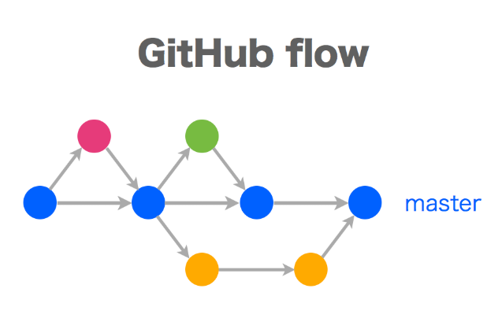
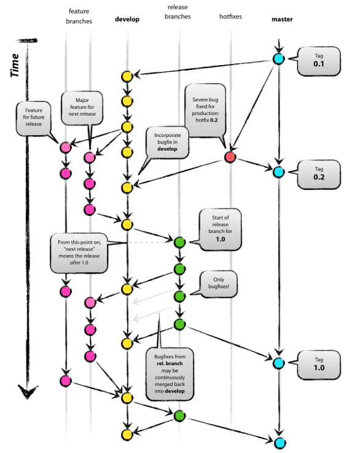

# 2019/01/07

## I. Git

### 1) Git basic command

* Git commit convention - "modify Readme.md" verb + object
* git remote -v : remote information
* git remote add (새로운 원격 저장소 생성) + remote 별명 + remote 주소
* git remote rename
* git remote remove
* origin - 첫 번째 remote 이름(convention)
* git clone : git 에 있는 것을 local로 맨 처음 옮길 때

### 2) Multi remotes, Multi PC

1. Company PC 
   1. Git 
   2. Initial commit (Push to remote) 
   3. Modify README(Push to remote)
   4. Add content (Pull from remote)
   5. Change README (Push to remote)
2. Bitbucket(origin)
   1. Initial commit(from Company PC)
   2. Modify README(from Company PC)
   3. Add content(from Home PC)
   4. Change README(from Company PC)
3.  Home PC
   1. Initial commit(Clone from remote)
   2. Modify README(Clone from remote)
   3. ADD content(Push to remote)
   4. Change README(Pull from remote)
4.  Github(second)
   1. Git remote add second https://github.com/ohjinseok/first_test
   2. Git push second master

### 3) One remote, Team

#### Head PC

1. git init
2. git add 
3. git commit
4. git remote add origin 주소
5. git push -u origin master
6. github 에서 collaborator 추가
7. Issue 발행
8. git pull origin master

#### Team members PC

1. collaborate 수락
2. git clone 주소
3. add, commit, push
4. Issue 

#### Issues

repository 의 게시판

1. New Issue
2. 해결
3. Close Issue

#### If conflict occurs..

git에서 바뀐 내용을 pull하지 않고 내용을 수정한다면?

수정 후 push하면 aborting error

다시 git add . -> git commit ~ -> git pull origin master 하면

자신이 수정한 내용과 remote의 내용이 뜬다(vs code에서)

option : accept current changes/accept incoming changes/accept Both changes/ Compare Changes

git add . -> git commit -m "merge conflict" -> git push origin master

대장 컴퓨터에서 다시 git pull origin master

### 4) Flow

#### Github flow

#### Git flow

### 5) Branch

#### git branch command

* git branch

  => 지금 현재 존재하고 있는 세계들

* git branch [다시 만난 세계]

  => 새로운 세계 생성

* first branch 

  => master(Convention)

* git checkout [가고자 하는 세계 이름]

  => 세계 이동 

* git merge [합치고자 하는 세계 이름] (!!인수하는 곳에서)

  => 세계 병합

* work flow : 잘 돌아가고 있는 세계에서 새로운 작업을 추가하고 싶을 때,

  ​		branch에서 새 작업 후 잘 돌아가면 merge한다.

## II. Flask

c9 주소 : https://ide.c9.io/

### 1) Flask란

Flask is a micro Framework  for Python based on Werkzeug, Jinja 2 and good intentions. 

[^framework]: a **software framework** is an [abstraction](https://en.wikipedia.org/wiki/Abstraction_(computer_science)) in which [software](https://en.wikipedia.org/wiki/Software) providing generic functionality can be selectively changed by additional user-written code, thus providing application-specific software.

* 특징 
  * Micro Framework(light and simple)
  * 높은 자유도
* WSGI(Werkzeug)
* Jinja2

### 2) Flask 실행

#### 2-1) Flask 설치

* sudo pip3 install flask

#### 2-2) app.py 작성

#### 2-3) Flask 실행

* flask run --port=8080 --host=0.0.0.0 : c9에서 돌려준다.

* 정보를 가져오는 방법(GET)
  * 
* 정보를 게시하는 방법(POST)
  * 

## III. CLI on Linux

### basic command

* cd : change directory
* ~ : home directory
* / : root directory
* pwd : current directory
* echo : print something
* 변수명 = " " : 변수 설정
* echo $(변수명) : 변수 출력
* echo ' ' > ' '.* : 특정 파일에 기록
* echo ' ' > ' '.* : 특정 파일에 이어쓰기
* cat () : concatenate files and print on the standard output
* man : 명령어 설명
* rm : 파일 삭제 -rf (recursively force)
* touch : 파일 생성
* mkdir : 디렉토리 생성
* mv : 파일 또는 디렉토리를 이동 또는 변경
  * mv 파일 변경할 디렉토리 : 파일 이동
  * mv 파일 변경할 이름 : 파일 변경
* tree : 디렉토리 구조 보여준다.
* . : 현재 디렉토리
* \* : 모든 파일
* cp : 파일 복사 -r  폴더 복사

### .bashrc edit

* alias : 명령어 별명을 붙여서 줄일 수 있다.
  * alias gs="git status"
  * alias gcm="git commit -,"
  * alias gp="git push"
  * alias gl="git log"
  * alias p3="python3"

* source ~/.bashrc : 명령어 소스 갱신
* export 변수명=내용 : 변수 저장