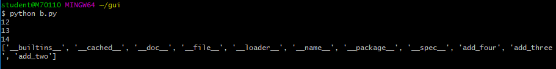
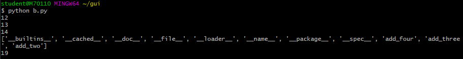
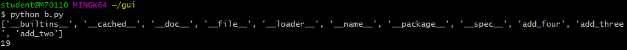
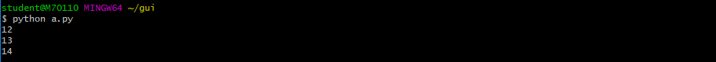
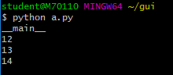
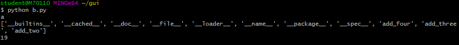

# 2019/01/10

## python

### I. container 연습문제

#### 1. 불쌍한 달팽이

```python
# 내 코드
# 여기에 코드를 작성하세요
def snail(height,up,down):
    cnt = 0
    while True:
        cnt += 1
        if height - up <= 0:
            break
        else:
            height = height - up + down
    return cnt
snail(100,6,5)

# 선생님 코드
def snail(height, day, night):
    count  = 0
    while True:
        count += 1
        height-=day
        if height <= 0:
            return count
        height += night
    return count
```

#### 2. 무엇이 중복일까

```python
# 내 코드
def duplicated(my_list):
    for i in list(set(my_list)):
        my_list.remove(i)
    return list(set(my_list))

duplicated(['a', 'b', 'c', 'b', 'd', 'm', 'n', 'n', 'b'])

def duplicated2(my_list):
    return list(set([x for x in my_list if my_list.count(x)>1]))

duplicated2(['a', 'b', 'c', 'b', 'd', 'm', 'n', 'n', 'b'])

# 선생님 코드
def duplicated(alphabets):
    duplicates = []
    for value in alphabets:
        if alphabets.count(value) > 1 and value not in duplicates:
            duplicates.append(value)
    return duplicates

def duplicated(alphabets):
    return list(set[value for value in alphabets if alphabets.count(value)])
 == return list({value for value in alphabets if alphabets.count(value)>1})
```

#### 3. 알파벳만 남기고 뒤집기

```python
# 내 코드
def reverse_letter(my_string):
    for i in my_string:
        if not i.isalpha():
            my_string = my_string.replace(i,'')
    return ''.join(reversed(my_string))

def reverse_letter2(my_string):
    return ''.join(reversed([i for i in my_string if i.isalpha()]))

# 선생님 코드
def reverse_letter(word):
    new_word = [char or char in word if char.isalpha()]
    return "".join(reversed(new_Word))
```

#### 4. 편-안한 단어

```python
# 내 코드
# 여기에 코드를 작성하세요.
def comfortable_word(my_word):
    left = ['q','w','e','r','t','a','s','d','f','g','z','x','c','v','b']
    right = ['y','u','i','o','p','h','j','k','l','n','m']
    if my_word[0] in left:
        is_left = True
    else:
        is_left = False
    => is_left = True my_word[0] in left else False
    for i in my_word[1:]:
        if is_left:
            if i in left:
                return False
            else:
                is_left = False
                continue
        else:
            if i in left:
                is_left = True
                continue
            else:
                return False
    return True

# 선생님 코드
def comfortalbe_word(word):
    left, right = "qwertasdfgzxcvb", "yuiophjklnm" # pythonic way
    
    l = True if word[0] in left else False
    
    for letter in word[1:]:
        if letter in left and l:
            return False
        if letter in right and not l:
            return False
        l = not l
    return True
```

#### 5. 숫자패턴

```python
# 내 코드
# 여기에 코드를 작성하세요
import math
def pattern(my_number):
    result = ""
    if my_number <= 0:
        return result
    for i in range(math.ceil(my_number/2)):
        result = result + (str(2*i+1) * (2*i +1)) + '\n'
    return result

def pattern2(my_number):
    result = [str(x)*x for x in range(1,my_number+1) if x % 2 == 1]
    return '\n'.join(result)

# 선생님 코드
def pattern(n):
    string = ""
    a = n
    if a % 2==0:
        a-=1
        for x in range(1, a+1):
            if x%2!=0:
                string += str(x) *
                
def pattern(n):
    result = [str(x) * x for x in range(1, n+1) if x%2]
    return "\n".join(result)
```

#### 6. 숫자가 좋아

```python
# 내 코드
def pick_and_sum(my_string):
    for i in my_string:
        if not i.isdigit():
            my_string = my_string.replace(i,' ')
    result = my_string.split()
    print(result)
    return sum(map(int,result))

# 지명이형 코드
def pick_and_sum(word):
    a = [char if char.isdecimal else " " for char in word]
    a="".join(a)
    return sum([int(jmi) for jmi in a.split()])

# 선생님 코드
def pick_and_sum(word):
    for c in word:
        if not c.isdecimal():
            word = word.replace(c," ")
    return sum([int(dji) for dji in word.split()])
#map
	return sum(list(map(int, word.split())))
# map(함수이름, 적용할 자료구조) -> map object(순회할 수 있는 자료구조)
# sum(리스트, 딕셔너리, 돌면서 쓰는(순회할 수 있는) 모든 자료구조(iterable))
	return sum(map(int,word.split()))
```

### II. map 연습

```python
# 각각의 숫자에 2를 더한 값을 넣어본세요.
num = [1,2,3,4,5,6]

def add_two(num):
    return num + 2
# 1. for를 써서 순회하며 새로운 리스트를 만들기
result = []
for i in num:
    result.append(add_two(i))
    
print(result)

# 2. list comprehension을 사용하기
print([add_two(x) for x in num])

# 3. map 사용하기
print(list(map(add_two,num)))
```

### III. 딕셔너리 메소드 활용

#### 추가 및 삭제

* `.pop(key[, default])`: key가 딕셔너리에 있으면 제거하고 그 값을 돌려줍니다. 그렇지 않으면 default를 반환합니다.

  default가 없는 상태에서 딕셔너리에 없으면 KeyError가 발생합니다. (순서가 없다!)

  ```python
  my_dict = {'apple': '사과', 'banana': '바나나'}
  my_dict.pop('apple')
  =>'사과'
  print(my_dict)
  =>{'banana': '바나나'}
  my_dict.pop('melon')
  ----------------------------------------------------------------
  KeyError                                  Traceback (most recent call last)
  <ipython-input-8-2a8b4f967f4a> in <module>
  ----> 1 my_dict.pop('melon')
  
  KeyError: 'melon'
  my_dict.pop('melon', 0)
  =>0
  ```

* `.update()`: 값을 제공하는 key, value로 덮어씁니다.

  ```python
  my_dict = {'apple': '사과', 'banana': '바나나', 'melon': '멜론'}
  my_dict.update(apple='사과아')
  print(my_dict)
  =>{'apple': '사과아', 'banana': '바나나', 'melon': '멜론'}
  
  my_dict.update({'kiwi':'키위'})
  print(my_dict)
  =>{'apple': '사과아', 'banana': '바나나', 'melon': '멜론', 'kiwi': '키위'}
  
  my_dict.update({'apple':'사과'})
  print(my_dict)
  =>{'apple': '사과', 'banana': '바나나', 'melon': '멜론', 'kiwi': '키위'}
  ```

* `.get(key[, default])`: key를 통해 value를 가져옵니다.

  절대로 KeyError가 발생하지 않습니다. default는 기본적으로 None입니다.

  ```python
  my_dict = {'apple': '사과', 'banana': '바나나', 'melon': '멜론'}
  my_dict['pineapple']
  ----------------------------------------------------------------
  KeyError                                  Traceback (most recent call last)
  <ipython-input-14-dae0385d9638> in <module>
        1 my_dict = {'apple': '사과', 'banana': '바나나', 'melon': '멜론'}
  ----> 2 my_dict['pineapple']
  
  KeyError: 'pineapple'
  
  my_dict.get('pineapple')
  =>
  
  my_dict.get('apple')
  => '사과'
  
  my_dict.get('pineapple', 0)
  0
  ```

#### dictionary comprehension

dictionary도 comprehension을 활용하여 만들 수 있습니다.

```python
cubic = {x: x**3 for x in range(1, 8)}
print(cubic)
=>{1: 1, 2: 8, 3: 27, 4: 64, 5: 125, 6: 216, 7: 343}

cubic = {x**3 for x in range(1, 8)}
print(cubic)
=>{64, 1, 8, 343, 216, 27, 125} # set이 된다.

# 다음의 딕셔너리에서 미세먼지 농도가 80 초과 지역만 뽑아 봅시다.
# 예) {'경기': 82, '부산': 90}
dusts = {'서울': 72, '경기': 82, '대전': 29, '중국': 200}
{key: value for key, value in dusts.items() if  value > 80}

new_dict = {}
for dust in dusts:
    if dusts[dust] > 80:
        new_dict[dust] = dusts[dust]
print(new_dict)
{'경기': 82, '중국': 200}

# 다음의 딕셔너리에서 미세먼지 농도가 80초과는 나쁨 80이하는 보통으로 하는 value를 가지도록 바꿔봅시다.
# 예) {'서울': '나쁨', '경기': '보통', '대전': '나쁨', '부산': '보통'}

dusts = {'서울': 72, '경기': 82, '대전': 29, '중국': 200}
{key: '나쁨' if value > 80 else '보통'  for key, value in dusts.items()}
{'서울': '보통', '경기': '나쁨', '대전': '보통', '중국': '나쁨'}

# 만약 elif 말해주면 이렇게 말해주자^_^ 강사용
{key: '매우나쁨' if value > 150 else '나쁨' if value > 80 else '보통' if value > 30 else '좋음'  for key, value in dusts.items()}
{'서울': '보통', '경기': '나쁨', '대전': '좋음', '중국': '매우나쁨'}
```

#### 정리! `map()`, `zip()`, `filter()`

* `map(function, iterable)` : 
  * Iterable의 모든 원소에 function을 적용한 후 그 결과를 돌려줍니다. 
  * 대표적으로 iterable한 타입 - list, dict, set, str, bytes, tuple, range

  * return은 map_object 형태로 됩니다.

* `zip(*iterables)`: 

  * 복수 iterable한 것들을 모아준다.
  * 결과는 튜플의 모음으로 구성된 zip object를 반환한다.

  ```python
  # 예시를 봅시다.
  girls = ['jane', 'iu', 'mary']
  boys = ['justin', 'david', 'kim']
  list(zip(girls, boys))
  => [('jane', 'justin'), ('iu', 'david'), ('mary', 'kim')]
  
  # for문으로 한 명씩 순서대로 매칭시켜봅시다.
  # 예) {'jane': 'justin', 'iu': 'david', 'mary': 'kim'}
  {x: y for x in girls for y in boys}
  # 이렇게 하면 이중 for문이라 key는 유일하니까 마지막 값으로 덮어씌어진다!!!
  => {'jane': 'kim', 'iu': 'kim', 'mary': 'kim'}
  
  {x: y for x, y in zip(girls, boys)}
  =>{'jane': 'justin', 'iu': 'david', 'mary': 'kim'}
  
  a = '123'
  b = '567'
  
  for digit_a, digit_b in zip(a, b):
      print(digit_a, digit_b)
  => 1 5
     2 6
     3 7
  # zip은 반드시 길이가 같을 때 사용해야한다. 가장 짧은 것을 기준으로 구성한다.
  num1 = [1, 2, 3]
  num2 = ['1', '2']
  list(zip(num1, num2))
  =>[(1, '1'), (2, '2')]
  ```

* `filter(function, iterable)`

  * iterable에서 function의 반환된 결과가 참인 것들만 구성하여 반환한다.

  ```python
  # 짝수인지 판단하는 함수를 작성해봅시다.
  def even(n):
      return not n%2
  a = [1, 2, 3]
  list(filter(even, a))
  => [2]
  # 다음의 list comprehension과 동일하다.
  [x for x in [1, 2, 3] if even(x)]
  => [2]
  # 다음의 list comprehension과 동일하다.
  [x for x in [1, 2, 3] if not x%2 ]
  => [2]
  ```

### IV. 세트 메소드 활용

#### 추가 및 삭제

* `.add(elem)`: elem을 세트에 추가합니다.

  ```python
  a = {1, 2, 3, 4}
  a.add(5)
  a.add(5)
  print(a)
  => {1, 2, 3, 4, 5}
  ```

* `update(*others)`: 여러가지의 값을 순차적으로 추가합니다.

  ​				  여기서 반드시 iterable한 값을 넣어야합니다.

  ```python
  a = {1, 2, 3}
  a.update({5, 5, 5, 2}, {7, 9})
  print(a)
  => {1, 2, 3, 5, 7, 9}
  ```

* `.remove(elem)`: elem을 세트에서 삭제하고, 없으면 KeyError가 발생합니다. 

  ```python
  a.remove(7)
  a.remove(3)
  print(a)
  => {1, 2, 5, 9}
  ```

* `discard(elem)`: x를 세트에서 삭제하고 없어도 에러가 발생하지 않습니다.

  ```python
  a = {1, 2, 3}
  a.discard(5)
  print(a)
  => {1, 2, 3}
  ```

* `pop()`: 임의의 원소를 제거해 반환합니다.

  ```python
  a = {7, 6, 21, 1}
  a.pop()
  => 1
  ```

### V. dictionary 연습문제

#### 1. 문자열 계산하기

```python
# 내 코드
# 여기에 코드를 작성하세요
def calc(equation):
    op = []
    for i in equation:
        if not i.isdecimal():
            op.append(i)
            equation = equation.replace(i,' ')
    num = list(map(int,equation.split()))

    if len(num) == len(op):
        result = 0
        for i in range(len(op)):
            if op[i] == '+':
                result += num[i]
            else:
                result -= num[i]
        return result
    else:
        result = num[0]
        for i in range(len(op)):
            if op[i] == '+':
                result += num[i+1]
            else:
                result -= num[i+1]
        return result
    
# 선생님 코드
def calc(equation):
    equation = equation.replace('+', ' +')
    equation = equation.replace('-', ' -')
    new_nums = []
    # for num in equation.split():
    #    new_nums.append(int(num))
    #    return sum(new_nums)
    # return sum[int(num) for num in equation.split()]
    # return sum(map(int, equation.split()))
    
def calc2(equation):
    result = 0
    tmp = ''
    for char in equation:
        if tmp and not char.isdecimal():
            result += int(tmp)
            tmp = ''
        tmp += char
    return result + int(tmp)
```

#### 2. 나만의 딕셔너리 생성기

```python
# 내 코드
# 여기에 코드를 작성하세요.
def create_dict(keys, values):
    if len(keys) >= len(values):
        for i in range(len(keys)-len(values)):
            values.append(None)
    return {x: y for x, y in zip(keys,values)}

# 선생님 코드
def create_dict(keys,values):
    new_dict = {}
    for i in range(len(keys)):
        if i < len(values):
            new_dict[keys[i]] = values[i]
            # new_dict.update({keys[i]: values[i]})
        else:
            new_dict[keys[i]] = None
            # new_dict.update({keys[i]: None})
    return new_dict

def create_dict2(keys, values):
    while len(keys) > len(values):
        values.append(None)
    new_dict = dict(zip(keys,values))
    return new_dict
```

#### 3. 시험 채점 시스템

```python
# 내 코드
# 여기에 코드를 작성하세요.
def check_score(real_answers, my_answers):
    result = 0
    for i in list(zip(real_answers,my_answers)):
        if i[1] == "":
            result += 0
        elif i[0] == i[1]:
            result += 4
        else :
            result -= 1
    return result if result >= 0 else 0

# 선생님 코드
def check_score(real_answers, my_answers):
    score = 0
    for i in range(0, len(real_answers)):
        if real_answers[i] == my_answers[i]:
            score += 4
        elif my_answers == "":
            score += 0
        else:
            score -= 1
     return score if score >= 0 else 0

def check_score2(real_answers, myanswers):
    return max(0,sum([4 if r == m else -1 for r, m in list(zip(real_answers, my_answers) ) if m]))
```

### VI. 모듈 활용 기초

#### import

``` python
# a.py

def add_two(num):
    return num + 2

def add_three(num):
    return num + 3

def add_four(num):
    return num + 4

print(add_two(10))
print(add_three(10))
print(add_four(10))
```

```python
# b.py

import a

print(dir(a))

def add_nine(num):
    return a.add_two(num) + 7
# +
print(add_nine(10))
```





**import 하는 것은 파일을 한 번 실행하고 온다는 뜻!**

**이를 방지하려면?**

```python
# a.py

def add_two(num):
    return num + 2

def add_three(num):
    return num + 3

def add_four(num):
    return num + 4

if __name__ == "__main__":
    print(add_two(10))
    print(add_three(10))
    print(add_four(10))
```





```python
# a.py

print(__name__)
```



```python
# a.py

print(__name__)
```



**\__name__에는 context의 정보가 들어있다.**

```python
# b.py

import a
from a import add_two as a2

print(dir(a))

def add_nine(num):
    return a2(num) + 7

print(add_nine(10))
```

```python
from flask import Flask, render_template
# flask.py 안의 class Flask(), def render_template 을 import
```

### VII. GUI

#### python tkinter

계속해서 화면을 렌더링함으로써 gui 인터페이스 제공

```python
#시작 
~~~ = Tk()

Label("어떤 프로그램에 넣을 지",text="무슨 말을 쓸 지") # 텍스트 출력

Button("어떤 프로그램에 넣을 지",text="무슨 말을 쓸 지",command="명령어") # 버튼 출력

.pack() # 앱의 기본 위치에 출력
~~~.mainloop()
#끝 
```


## WS & HW

### I. GUESS & CHECK

```python
def sqrt():
    함수내용
    
sqrt(4) ==> 2.000000
```

**근사값의 판단 기준은 오차 범위 0.000001**

1. 4가 주어지면
2. 4보다 작은 숫자들로 시작하여,
3. 제곱한 결과를 4와 비교하고,
4. 4와 충분히 가까워지면,
5. 근사값이라 판단하고 반환한다.

```python
# my code
def sqrt(num):
    result = num
    judge = num - result * result
    while abs(judge) > 0.000001:
        result -= 0.0000001
        judge = num - result * result
    return result

print (sqrt(8)**2 - 8)

# 선생님 코드
def sqrt(num):
    guess = 0.0
    diff = 0.000001
    increment = diff ** 2
    
    while(abs(guess ** 2 - num)) >= diff:
        guess += increment
       
    return guess
sqrt(2)
```

### II. bisection search를 통해서 개선하기

```python
def sqrt_bi(num,a,b):
    if abs(num - a**2) <= 0.000001 and abs(num - b**2) <= 0.000001:
        return a,b
    else:
        return sqrt_bi(num,(a+b)/2,b) if ((a+b)/2) ** 2 <= num else sqrt_bi(num,a,(a+b)/2)

sqrt_bi(3,0,3)

# 선생님 코드
def sqrt_bisect(num):
    guess = (min_value + max_value) / 2.0
    diff = 0.0001
    min_value = 0.0
    max_value = num
    
    while(abs(guess ** 2 - num)) >= diff:
        if guess ** 2 < num:
            min_value = guess
        else:
            max_value = guess
        guess = (min_value + max_value) / 2.0
    return guess

sqrt_bisect(2)
```


## 꿀팁

* spoqa 기술 블로그

* lint로 코드 개선

* happy hacking 키보드

* aws reinvent

