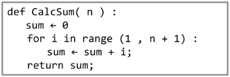
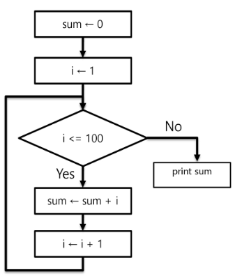
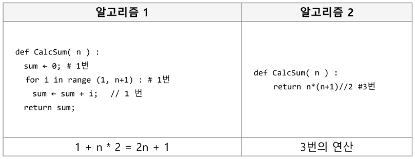
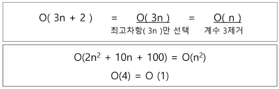
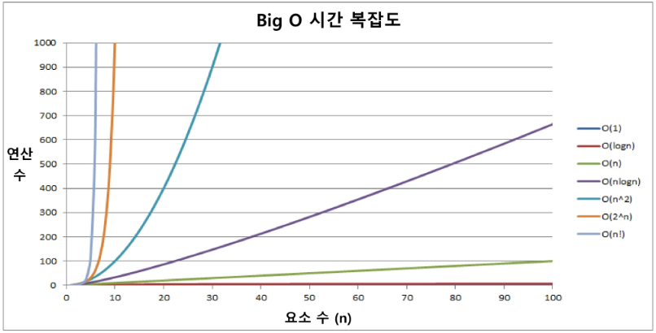
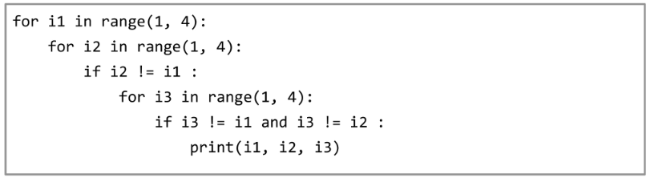
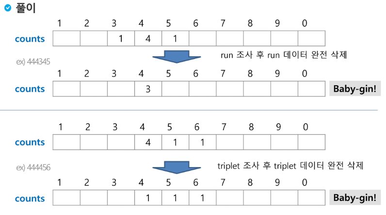
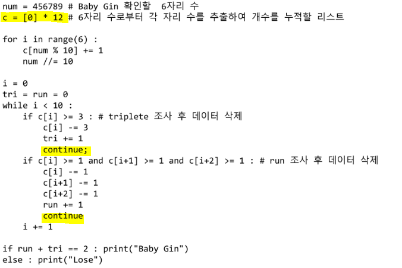
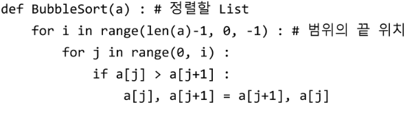
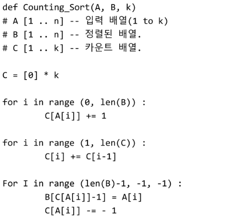

# 2019/01/14

## Roadmap

### 자료구조

#### 선형 자료구조

: 하나의 element 다음에 하나의 elemet가 존재

##### **배열**

##### **문자열**

##### **리스트**

##### **스택**

##### **큐**

#### 비선형 자료구조

: 하나의 element 다음에 몇 개의 elment든 붙을 수 있는 것

##### 트리

* 표현 : 1차, LinkedList
* 순회 : pre-order, in-order, post-order

##### 그래프

* 표현 : 인접 행렬, 인접 리스트
* 순회 : DFS(Stack), BFS(Queue)

### 알고리즘

#### 알고리즘 설계 기법

##### **완전 검색**

조합론 : 	Back Tracking으로 대부분 구한다.

​		때에 따라서 가지치기를 해야한다.(필요없는 케이스 검사하지 않는 것)		

* 순열(중복)
* 조합(중복)
* 부분집합

##### **그리디**

##### **Divide and Conquer** (이진 탐색, 퀵 정렬, 병합 정렬)

##### **Back Tracking**(상태 공간 트리 + DFS)

##### **Dynamic Programming** 

* 재귀적 DP
* 반복적 DP

## 알고리즘

### 알고리즘이란?

유한한 단계를 통해 문제를 해결하기 위한 절차나 방법이다.

### 알고리즘 표현 방법

* **Pseudo Code**

  

* **Flow Chart**

### 좋은 알고리즘이란?

* **정확성** : 얼마나 정확하게 동작하는가
* **작업량** : 얼마나 적은 연산으로 원하는 결과를 얻어내는가(시간)
* **메모리 사용량** : 얼마나 적은 메모리를 사용하는가
* **단순성** : 얼마나 단순한가 (코드가 어려우면 유지 보수가 어려움)
* **최적성** : 더 이상 개선할 여지없이 최적화 되었는가

### 알고리즘의 성능

알고리즘의 작업량을 표현할 때 시간 복잡도로 표현한다. 

#### 시간 복잡도(Time Complexity)

실행되는 명령문의 개수를 계산

#### Big-O Notatiton

* 시간 복잡도 함수 중에서 가장 큰 영향력을 주는 n에 대한 항만을 표시
* 계수는 생략하여 표시

### 배열

일정한 자료형의 변수들을 하나의 이름으로 열거하여 사용하는 자료구조

#### 배열의 필요성

프로그램 내에서 여러 개의 변수가 필요할 때, 일일이 다른 변수명을 이용하여 자료에 접근하는 것은 매우 비효율적일 수 있따.

배열을 사용하면 하나의 선언을 통해서 둘 이상의 변수를 선언할 수 있다.

#### 연습문제

**논리를 세우고! 프로그래밍 시작!** 

#### 완전 검색(Exaustive Search, Brute-force)

문제의 해법으로 생각할 수 있는 모든 경우의 수를 나열해보고 확인

모든 경우의 수를 순열로 생성한다.

##### 순열 생성 방법

나중에는 Back tracking으로 구현 가능

#### 탐욕(Greedy) 알고리즘

* 여러 경우 중 하나를 결정해야 할 때마다 그 순간에 최적이라고 생각되는 것을 선택해 나가는 방식으로 진행하여 최종적인 해답에 도달한다.

* 예) 거스름돈 줄이기
  * 1) 해 선택 : 단위가 가장 큰 동전을 선택한다.
  * 2) 실행 가능성 검사 : 거스름돈이 액수를 초과하는 지 확인한다. 초과한다면 마지막에 추가한 동전을 거스름돈에서 빼고 한 단계 작은 단위의 동전을 추가
  * 3) 해 검사 : 거스름돈과 액수가 일치하는 지 확인한다.

* 예) baby-gin - greedy algorithm

  * counts 배열의 각 원소를 체크하여 run과 triplet 및 baby-gin 여부를 판단

    

    

    

  * 배열을 12개로 한 이유는 효율적으로 0 ~ 9까지 탐색하기 위해서

  * continue 문을 쓴 이유는 i를 증가시키지 않고 다시 그 부분부터 조사하기 위해

  * 효율적인 방법만을 외워서는 위험하다!! 여러 알고리즘을 공부하는 것이 좋다!

  * Greedy는 정말 잘 알아야 한다! 큰 수부터 없애야 함!

### 정렬

#### Bubble Sort

**인접한 두 개의 원소를 비교하며 자리를 계속 교환하는 방식**

* 첫 번째 원소부터 인접한 원소끼리 계속 자리를 교환하면서 맨 마지막 자리까지 이동
* 한 단계가 끝나면 가장 큰 원소가 마지막 자리로 정렬된다.
* 교환하며 자리를 이동하는 모습이 물 위에 올라오는 거품 모양 같아 Bubble Sort

**시간 복잡도 $O(N^2)​$**

**코드 구현**

for 문이 n에 depend 되고, 종속되는 for 문도 n에 (직)간접적으로 depend 되므로

시간 복잡도 $O(N^2)​$

#### Counting Sort

항목들의 순서를 결정하기 위해 집합에 각 항목이 몇 개씩 있는지 세는 작업을 하여,

선형 시간에 정렬하는 효율적인 알고리즘(제한사항 : 범위가 넓으면 메모리 차지 심함)

**코드 구현**

위의 코드는 counting된 수 중에서도 출현한 순서대로 구분할 필요가 있을 때 사용한다.

카운트 배열 접근(k), 입력 배열 접근(n), 정렬 배열 접근(n) -> $O(n+k)$ 