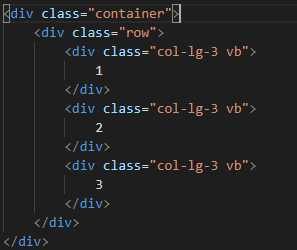

# 2019/01/16

## 1. Web

SaaS(Software as a Service)

Service -> Request + Response

Inventor of World Wide Web - Tim berners lee

Web은 문서를 주고받는 것이다.

request 

* Get(줘라)
* Post(받아라)

표준을 지킵시다

Static Web -> 클라이언트가 요청을 보내면 서버가 응답한다. 

클라이언트가 요청을 보내는 프로그램?

### IP(Internet Protocol)

* 172.217.27.78

* 8비트(0 ~ 255)까지의 숫자로 구성된 숫자의집합으로, 각자가 가지고 있는 주소와 동일하다.

### 도메인(Domain)

* google.com

* 네트워크상의 컴퓨터를 식별하는 호스트명

### URL(Uniform Resource Locator)

* https://www.google.co.kr/search 

* 도메인 + 경로, 실제로 해당 서버에 저장된 자료의 위치

Dynamic Web

### HTML

**Hyper Text Markup Language**

**http(s) -> Hyper Text Transfer Protocol**

https://hphk/lectures/1 -> RESTful 한 웹서비스

정보와 구조화

#### Box Model


- margin = tag 사이 공간
- padding = contents와 box 사이의 공간
- border = box의 경계선

### Css

Cascading(상속) Style Sheet

웹에 옷을 입히는 것

Bootstrap -> CSS Framework

여러 가지 tag가 있을 경우 더 상세한 것을 적용한다.

!important - 위의 모든 순서를 무시하고, 가장 먼저 우선순위를 부여합니다.

### JS

Java Script -> 웹을 움직이게 하는 것

ecma - es6가 현재 표준

## 2. Tag 와 DOM TREE

### 2.1. 요소(Element)

HTML의 element 는 태그와 내용(contents)로 구성되어 있다.

```html
<h1> 웹 문서 </h1>
태그   내용   태그
```

### 2.2. Self-closing element

```html

id, class, style은 태그와 상관없이 모두 사용 가능하다.
```

### 2.3. 속성(Attribute)

```html
<a href='google.com'/>
   속성명  속성값
태그에는 속성이 지정될 수 있다.
```

### 2.4. DOM TREE

태그는 중첩되어 사용가능하며, 이때 다음과 같은 관계를 갖는다.(Document Object Model)

태그들이 DOM TREE 형태로 구조화 되어있다.

```html
<body>
    <
</body>
```


### 2.5. 시맨틱 태그

컨텐츠의 의미를 설명하는 태그로서, HTML5에 새롭게 추가된 시맨틱 태그가 있다.


## 3. Bootstrap

### Quick Start

CDN(Content Delivery Network)를 통해 Bootstrap에 작성된 CSS, JS를 활용

### 3.1. Spacing

* .m-0 : margin - 0
* .mr, ml, mt, mb - 0 : 가능
* .mx, my : margin 가로 margin 세로
* .py-0 : padding 세로
* .mt-1 : margin top 0.25rem
* .mt -2 3 4 5 : 8px 16px 24px 48px
* .mt- n~ : 음수 -4px -8px ~ ~ ~

### 3.2. Color


* bg-primary, bg-secondary 등으로 배경색
* text-~~~ 글자색
* alert-~~
* btn-~~
* navbar-~~

### 3.3. Border

* class = "border border-success" success색 경계선
* rounded : 경계선 둥글게

### 3.4. Display

### 3.5. Grid system

Modern Web Design Grid = 12

Grid 안의 컨텐츠의 개수가 12를 넘지 않도록 한다.

또한 12의 약수 개수의 컨텐츠를 넣는다.



## 꿀팁

Berkeley - CS169 Software Engineering

https://bcourses.berkeley.edu/courses/1477171

https://www.edx.org/course/agile-development-using-ruby-on-rails-the-basics

https://www.edx.org/course/agile-development-using-ruby-on-rails-advanced

교재 

https://www.amazon.com/Engineering-Software-Service-Approach-Computing/dp/0984881247

Computer Organization And Design - David Patterson

web developer chrome extension

https://chrome.google.com/webstore/detail/web-developer/bfbameneiokkgbdmiekhjnmfkcnldhhm

csrf - 보안

https://poiemaweb.com/

freecodecamp

https://www.freecodecamp.org/