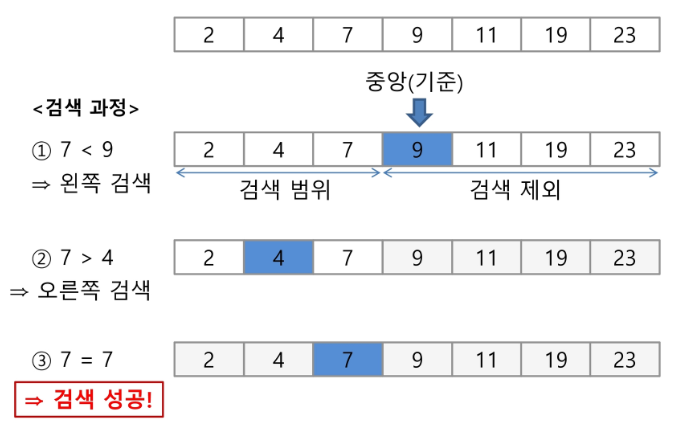
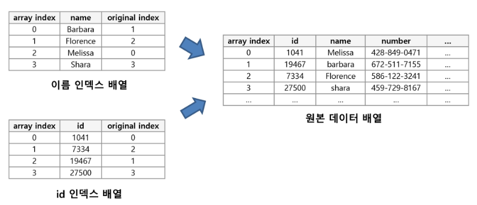

# 2019/01/21

## 2차원 배열

### 2차원 배열의 선언

* 1차원 list를 묶어놓은 list
* 2차원 이상의 다차원 list는 차원에 따라 Index 선언

### 2차원 배열의 활용

#### 배열 순회

```python
# 행 우선 선회
for i in range(len(Array)):
    for j in range(len(Array[i])):
        Array[i][j]
        
# 열 우선 선회
for j in range(len(Array[0])):
    for i in range(len(Array)):
        Array[i][j]
        
# 지그재그 순회
for i in range(len(Array)):
    for j in range(len(Array[0])):
        Array[i][j + (len(Array[0]) - 1 - 2 * j) * (i % 2)]
```

#### 델타를 이용한 2차 배열 탐색

```python
#2차 배열의 한 좌표에서 4방향의 인접 배열 요소를 탐색하는 방법
ary[0...n-1][0...n-1]
dx = [0, 0, -1, 1]
dy = [-1, 1, 0, 0]

fox x in range(len(ary)):
    for y in range(len(ary[x])):
        for I in range(4):
            textX = x + dx[mode]
            textY = y + dy[mode]
            test(ary[textX][textY])
```

#### 전치행렬

```python
arr = [[1,2,3],[4,5,6],[7,8,9]] # 3 * 3 행렬

for i in range(3):
    for j in range(3):
        if i < j:
            arr[i][j], arr[j][i] = arr[j][i], arr[i][j]
```

#### 연습문제 1

```python
import random

dx = [-1, 0, 1, 0]
dy = [0, 1, 0, -1]


nums = [[1,1,1,1,1],[1,0,0,0,1],[1,0,0,0,1],[1,0,0,0,1],[1,1,1,1,1]]
# nums = []
# for _ in range(5):
#     nums.append(random.sample(range(1,46),5))

result = 0

for i in range(5):
    for j in range(5):
        for k in range(4):
            if (i + dx[k]) >= 0 and (j + dy[k]) >= 0 and (i + dx[k] <= 4) and (j + dy[k] <= 4):
                result += abs(nums[i + dx[k]][j + dy[k]] - nums[i][j])

print(result)
```

## 부분집합 합(Subset Sum)

* 유한 개의 정수로 이루어진 집합이 있을 때, 이 집합의 부분집합 중에서 그 집합의 원소를 모두 더한 값이 0이 되는 경우가 있는 지를 알아내는 문제

### 부분집합 생성하기

* 부분집합의 수

  * 집합의 원소가 n개일 때, 공집합을 포함한 부분집합의 수는 $ 2^n$  개이다.

  ```python
  bit = [0, 0, 0, 0]
  for i in range(2):
      bit[0] = i
      for j in range(2):
          bit[1] = j
          for k in range(2):
              bit[2] = k
              for l in range(2):
                  bit[3] = l
                  print(bit)
  ```

### 비트 연산자

> & 비트 단위로 AND 연산을 한다.
>
> | 비트 단위로 OR 연산을 한다.
>
> << 피연산자의 비트 열을 왼쪽으로 이동시킨다.
>
> \>> 피연산자의 비트 열을 오른쪽으로 이동시킨다.

* << 연산자
  * 1 << n : $ 2^n$ 즉, 원소가 n개일 경우의 모든 부분집합의 수를 의미한다.
* & 연산자
  * i & (1 << j) : i의 j번째 비트가 1인지 아닌지를 리턴한다.

#### 비트 연산자를 이용한 부분집합 생성

```python
arr = [3, 6, 7, 1, 5, 4]

n = len(arr)

for i in range(1 << n):
    for j in range(n):
        if i & (1 << j):
            print(arr[j], end = ", ")
    print()
print()
```

#### 연습문제 2

```python
# 부분집합 합 문제 구하기
# 10개의 정수를 입력 받아 부분집합의 합이 0이 되는 것이 존재하는 지를 계산하는 함수를 작성해보자.

inputs = []

for _ in range(10):
    inputs.append(int(input()))

for i in range(1 << 10):
    result = []
    for j in range(10):
        if i & (1 << j) > 0:
            result.append(inputs[j])
    if sum(result) == 0 and len(result) != 0:
        print(result)
```

## 검색(Search)

* 저장되어 있는 자료 중에서 원하는 항목을 찾는 작업
* 목적하는 탐색 키를 가진 항목을 찾는 것
  * 탐색 키(search key) : 자료를 구별하여 인식할 수 있는 키

### 순차 검색(Sequential Search)

* 순차구조로 구현된 자료구조에서 원하는 창목을 찾을 때

#### 정렬되어 있는 경우

* 첫 번째 원소부터 순서대로 검색 대상과 키 값이 같은 원소가 있는지 비교하며 찾는다.

  ```python
  def sequentialSearch2(a, n, key):
      i = 0
      while i < n and a[i] < key:
          i = i + 1
      if i < n and a[i] == key : return i
      else return -1
  ```

* $O(n)​$ 에 의존

#### 정렬되어 있지 않은 경우

```python
def sequentialSearch(a, n, key):
    i = 0
    while i < n and a[i] != key:
        i = i + 1
    if i < n : return i
    else : return -1
```

* $O(n)$ 에 의존

### 이진 검색(Binary Search)

* 이진 검색을 하기 위해서는 자료가 정렬된 상태여야 한다.

* 자료의 가운데에 있는 항목의 키 값과 비교하여 다음 검색의 위치를 결정하고 검색

  

  ```python
  def binarySearch(a, key):
      start = 0
      end = length(a) - 1
      while start <= end:
          middle = (start + end) // 2
          if a[middle] == key:
              return true
          elif a[middle] > key:
              end = middle - 1
          else :
              start = middle + 1
      return false
  ```

  ``` python
  # 재귀 함수 이용
  def binarySearch2(a, low, high, key):
      if low > high:
          return False
      else:
          middle = (low + high) // 2
          if key == a[middle]:
              return True
          elif key < a[middle]:
              return binarySearch2(a, low, middle - 1, key)
          elif a[middle] < key:
              return binarySearch2(a, middle + 1, high, key)
  ```

### 인덱스

인덱스를 저장하는데 필요한 디스크 공간은 보통 테이블을 저장하는데 필요한 디스크 공간보다 작다. 왜냐하면 보통 인덱스는 키-필드만 갖고 있고 다른 세부 항목들은 갖고 있지 않다.



### 셀렉션 알고리즘

1. 정렬 알고리즘을 이용하여 자료 정렬하기
2. 원하는 순서에 있는 원소 가져오기

```python
# k번째로 작은 원소를 찾는 알고리즘
# 1번부터 k번째까지 작은 원소들을 찾아 배열의 앞쪽으로 이동시키고, 배열의 k번째를 반환
# k가 비교적 작을 때 유용하며 O(kn)의 수행시간을 필요로 한다.
def select(list, k):
    for i in range(0, k):
        minIndex = i
        for j in range(i + 1, len(list)):
            if list[minIndex] > list[j] :
                minIndex = j
        list[i], list[minIndex] = list[minIndex], list[i]
    return list[k - 1]
```

### 선택 정렬(Selection Sort)

* $O(n^2)$ 에 의존
* 셀렉션 알고리즘을 끝까지 진행한 경우

```python
def selectionSort(a):
    for i in range(0, len(a) - 1):
        min = i
        for j in range(i + 1, len(a)):
            if a[min] > a[j]:
                min = j
        a[i], a[min] = a[min], a[i]
```

