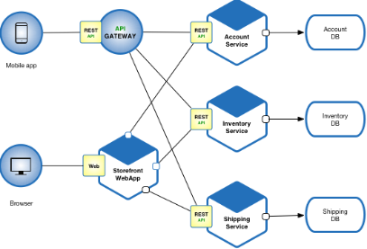
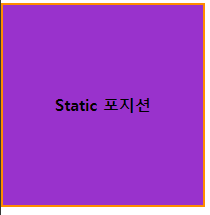
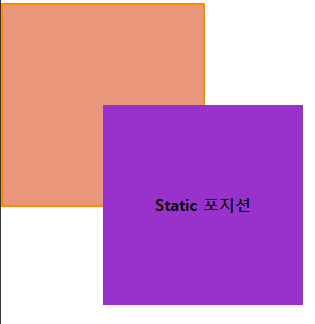
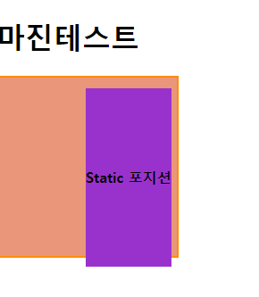
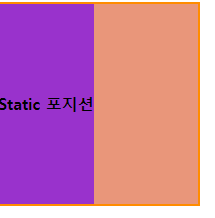
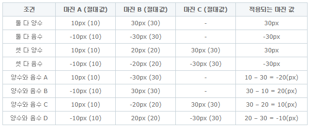

# 2019/01/23

## OOP

```python
name = 'hong'
class Person:
    name = 'choi'
    def greeting(self):
        print(name)
        
p1 =Person()
p1.greeting()
# hong -> class 변수에 접근하지 않는다.

name = 'hong'
class Person:
    name = 'choi'
    def greeting(self):
        print(self.name)
        
p1 = Person()
p1.greeting()
# choi -> self.name을 하면 instance 

name = 'hong'
class Person:
    name = 'choi'
    def greeting(self):
        print(name)
        
p1 = Person()
p1.greeting()
print(p1.name)
# hong 
# choi -> instance 변수에 접근

name = 'hong'
class Person:
    name = 'choi'
    def greeting(self):
        print(self.name)
        
p1 = Person()
p1.name = 'kim'
p1.greeting()
print(Person.name)
# kim -> instance 변수
# choi -> class 변수

name = 'hong'
class Person:
    name = 'choi'
    def greeting(self):
        print(self.name)
        
p1 = Person()
Person.name = 'kang'
p1.greeting()
p1.name = 'oh'
p1.greeting()
# kang -> instance 변수에 없으면 class 변수 접근
# oh -> instance 변수에 있으므로 instance 변수
```

### microservice architecture

**Microservices** are a software development technique—a variant of the service-oriented **architecture** (SOA) **architectural** style that structures an application as a collection of loosely coupled services. In a **microservices architecture**, services are fine-grained and the protocols are lightweight.



* 기술 부채를 줄일 수 있다.

## WEB

### Display

#### 1. block

* 항상 새로운 라인에서 시작한다.

* 화면 크기 전체의 가로 폭을 차지한다. (width : 100%)

* block 레벨 요소 내에 inline 레벨 요소를 포함할 수 있다.

* ex) div, h1 ~ h6, p, ol, ul, li, hr, table, form (태생은 block이지만 바꿀 수 있다.)

#### 2. inline

* 새로운 라인에서 시작하지 않으며 문장의 중간에 들어갈 수 있다.
* content의 너비만큼 가로폭을 차지한다.
* width, height, margin-top, margin-bottom 프로퍼티를 지정할 수 없다.(margin-left,right는 가능)
* 상, 하 여백은 line-height로 지정한다.
* ex) span, a, strong, img, br, input, select, textarea, button(태생은 inline이지만 바꿀 수 있다.)

#### 3. inline-block

* block과 inline 레벨 요소의 특징을 모두 갖는다.
* inline 레벨 요소퍼럼 한 줄에 표시 되면서, block에서의 width, height, margin(top, bottom) 속성을 모두 지정할 수 있다.

#### 4. None

* 해당 요소를 화면에 표시하지 않는다.(공간조차 사라진다.)

### Visibility

#### 1. visible

해당 요소를 보이게 한다.(기본값)

#### 2. hidden

해당 요소를 안보이게 한다.

### Background-image

```css
body {
    background-image: url("https://orig0.hdxwallpaper.com/dl/hd/97/seolhyun-heart-gift-k_pop-singer-girl-(979)-728x410.jpg");
    background-repeat: no-repeat;
    background-position: center;
    background-size: cover;
}	
```


### Font & Text

* google fonts
* spoqa han sans

### Casacading

Conflict 되는 여러 가지 요소가 있다면, 가장 직접적인 것의 영향을 받는다.

#### CSS의 상세정도 순서

1. !important 형님
2. inline tag
3. #id
4. .class
5. tag 이름
6. global

#### CSS의 선언 순서

무조건 뒤에 정의된 것이 적용

### Position

**요소의 위치를 정의!**

#### 1. static(기본 위치)

* 위에서 아래로, 왼쪽에서 오른쪽으로 순서에 따라 배치
* 부모 요소 내에 자식 요소로서 존재할 때는 부모 요소의 위치를 기준으로 배치

#### 2. relative(상대 위치)

* 기본 위치를 기준으로 좌표 프로퍼티를 사용하여 위치를 이동

#### 3. absolute(절대 위치)

* 부모 요소 또는 가장 가까이 있는 조상 요소(static 제외)를 기준으로 좌표 프로퍼티만큼 이동
* relative, absolute, fixed 프로퍼티가 선언되어 있는 부모 또는 조상 요소를 기준으로 위치 결정

#### 4. fixed(고정 위치)

* 부모 요소와 관계없이 브라우저의 viewport를 기준으로 좌표 프로퍼티를 사용하여 위치를 이동
* 스크롤이 되더라도 화면에서 사라지지 않고 항상 같은 곳에 위치

#### 5. example

```html
<body>
    <h1>마진테스트</h1>
    <div class="parent">
        <div class="child">
            Static 포지션
        </div>
    </div>
</body>
```

```css
.parent{
    width: 200px;
    height: 200px;
    background-color: darksalmon;
    /* border: (선 굵기) (스타일) (색) */
    border: 2px solid darkorange
}

.child{
    background-color: darkorchid;
    color: black;
    font-weight: bold;
    text-align: center;
    line-height: 200px;
}
```



```css
.child{
    position: relative;
    top: 100px;
    left: 100px;
    background-color: darkorchid;
    color: black;
    font-weight: bold;
    text-align: center;
    line-height: 200px;
}
```



```css
.child{
    position: absolute;
    top: 100px;
    left: 100px;
    background-color: darkorchid;
    color: black;
    font-weight: bold;
    text-align: center;
    line-height: 200px;
}
```



```css
.child{
    position: absolute;
    /* top: 100px;
    left: 100px; */
    background-color: darkorchid;
    color: black;
    font-weight: bold;
    text-align: center;
    line-height: 200px;
}
```



## Bootstrap

### Container

모든 모니터에서 웹사이트를 보여주기 위해 width - 100%를 적용시킨다.

따라서 contents들을 container에 넣어서 page를 작성

### flex

부모 속성이 flex이면 자식이 block이여도 inline 형식으로 나온다.

flex의 자식들을 정렬시킬 수 있다.

12 column으로 나뉘어져 있다.

### Etc..

#### margin collapse

* top, bottom의 margin은 큰 수의 margin으로 병합된다.

* left, right의 margin은 모두 살아서 들어간다.

  

## 꿀팁

* https://www.color-hex.com/ 

* ul>li*3 tab

  ```html
  <ul>
      <li></li>
      <li></li>
      <li></li>
  </ul>
  ```

