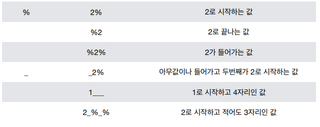

# 2019/01/30

## Database

데이터베이스는 **체계화된 데이터의 모임**

* Create
* Read
* Update
* Delete

**RDBMS(관계형 데이터베이스 관리 시스템)**

관계형 모델을 기반으로하는 데이터베이스 관리 시스템

### 기본 용어 정리

#### 스키마

데이터베이스에서 자료의 구조, 표현방법, 관계 등을 정의한 구조


#### 테이블

엑셀로 비유하면 데이터베이스는 하나의 엑셀 파일

테이블은 엑셀 파일 안의 하나의 시트


### 1. SQL 개념

**SQL(Structured Query Language)** 관계형 데이터베이스 관리시스템의 데이터를 관리하기 위해 설계된 특수 목적의 프로그래밍 언어

#### DDL(데이터 정의 언어) 

데이터를 정의하기 위한 언어

데이터베이스 구조를 정의하기 위한 명령어

* CREATE
* DROP
* ALTER

#### DML(데이터 조작 언어)

데이터를 저장, 수정, 삭제, 조회 등을 하기 위한 언어

* INSERT
* UPDATE
* DELETE
* SELECT

#### DCL(데이터 제어 언어)

데이터베이스 사용자의 권한 제어를 위해 사용되는 언어

* GRANT
* REVOKE
* COMMIT
* ROLLBACK

### 2. Hello, DB!

> sqllite를 활용하여 Databse 조작 연습!

.mode csv -> csv 파일 조작

.import 파일명 테이블명 -> 파일명으로부터 데이터를 받아 테이블을 만듦

.tables -> 생성되어 있는 table 목록 확인

SELECT column명 FROM 테이블명 -> 테이블에 있는 데이터를 가져옴

column명, column명 ...으로 여러 개 선택 가능


#### 1. database 생성

> 데이터베이스 콘솔에서 한 작업은 남지 않는다.
>
> db or sqlite3 파일에 저장해야 한다.
>
> sqlite3 ~.db or ~.sqlite3


#### 2. Table 생성

> CREATE TABLE 테이블명 (~~~)
>
> .schema 테이블명 -> 테이블의 schema 확인


> 테이블과 DB의 관계


> Datatype


> DROP 테이블명 -> 테이블 삭제

sql 파일을 통해 데이터베이스를 조작할 수도 있다.

#### 3. 데이터 추가, 읽기, 수정, 삭제

##### 1. data 추가(INSERT)

> INSERT INTO table (column1, column2, ..)
>
> ​		VALUES (value1, value2, ...)

> PRIMARY KEY 로 되어있는 column은 입력하지 않으면 자동으로 UNIQUE 값으로 저장 INT일 경우 1 증가
>
> 같은 ID를 넣을 경우 UNIQUE constraint ERROR가 발생한다.
>
> ID가 빈 경우가 있어도 마지막 ID에서 1추가 한 값이 들어간다.
>
> ID가 순서대로 들어가지 않아도 자동으로 오름차순으로 정렬한다.

> 모든 column에 값이 들어갈 경우 column 명을 생략해도 된다.

> Data table의 값을 비우지 않도록 한다. 값이 없을 경우 없다는 것을 명시!

```sqlite
CREATE TABLE classmates (
    id INTEGER PRIMARY KEY AUTOINCREMENT,
    name TEXT NOT NULL,
    age INTEGER NOT NULL,
    address TEXT NOT NULL
); -- 일반적인 TABLE 생성문
```

##### 2. data 가져오기(SELECT)

```sql
SELECT * FROM table

SELECT column1, column2 FROM table

SELECT * FROM table LIMIT A OFFSET B; -- (A개 조회, B개 떨어져서)

SELECT * FROM table WHERE column = value 
-- where -> 조건문 =, ==, is 다 됨
SELECT COUNT(*) FROM table -- data 수 조회
```

##### 3. data 삭제(DELETE)

```sql
DELETE FROM table WHERE condition
-- 대체로 primary key를 조건으로 삭제하게 된다.
```

> Data가 지워졌을 때, id가 비게 되므로 Table의 history를 알 수 있다.
>
> 또한 지워진 id를 다시 쓰게 되면, 예전에 썼던 code와 충돌 현상이 날 수 있으므로 안 쓰는 것이 좋다.

##### 4. data 수정(UPDATE)

```SQL
UPDATE table SET column1=value1, column2=value2,... WHERE condition
```

##### 5. WHERE, expression

###### 1. WHERE 심화

```SQL
SELECT age, last_name FROM users WHERE age >= 30 and last_name = "김"
```

###### 2. Expression

```sql
COUNT()
AVG()
SUM()
MIN()
MAX()
```

###### 3. LIKE



##### 6. ORDER

```SQL
ORDER BY column1, column2, ... [ASC/DESC]
-- column 명 먼저 나온 것부터 정렬
```


## 꿀팁

https://www2.eecs.berkeley.edu/Courses/CS186/

https://lagunita.stanford.edu/courses/Engineering/db/2014_1/about

