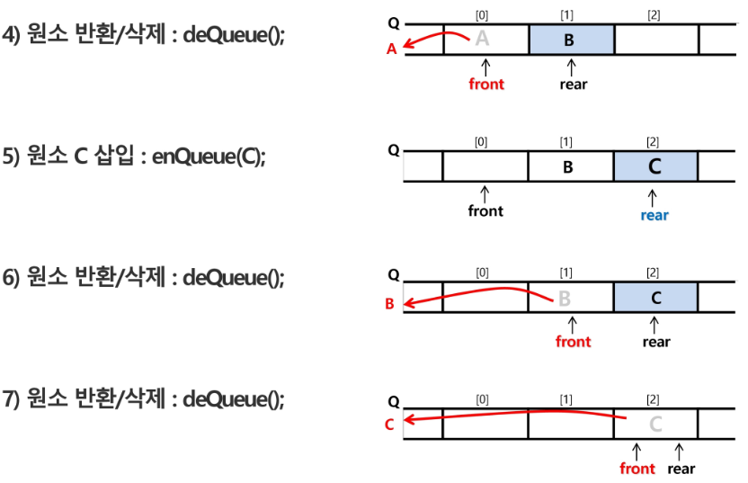
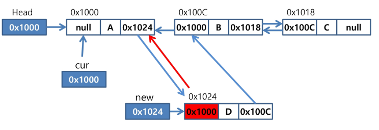

# Data Structure

## 1. Stack

### 특성

* 자료를 쌓아 올린 형태의 자료구조
* 선형 구조(자료 간의 관계가 1대1)
* LIFO(Last-In-First-Out)

* 마지막 삽입된 원소의 위치를 top이라 부른다.

### 연산

* 삽입 : 저장소에 자료를 저장한다. push
* 삭제 : 저장소에서 자료를 꺼낸다. 삽입의 역순 pop
* 공백인지 확인 : isEmpty
* top에 있는 item 반환 : peek


### Function call

* 마지막에 호출된 함수가 가장 먼저 실행을 완료하고 복귀하는 LIFO 구조이므로, LIFO 구조의 스택을 이용하여 수행순서 관리
* 함수 호출이 발생하면 호출한 함수 수행에 필요한 지역변수, 매개변수 및 수행 후 복귀할 주소 등의 정보를 stack frame에 저장하여 시스템 스택에 삽입
* 함수의 실행이 끝나면 시스템 스택의 top 원소를 삭제하면서 프레임에 저장되어 있던 복귀주소를 확인하고 복귀
* 함수 호출과 복귀에 따라 이 과정을 반복하며 전체 프로그램 수행이 종료되면 시스템 스택은 공백 스택이 된다.


### Recursive call

**자기 자신을 호출하여 순환 수행되는 것**

프로그램의 크기를 줄이고 간단하게 작성할 수 있다.

#### factorial

```python
def fact(n):
    if n < 2:
        return 1
    return n * fact(n - 1)
```


#### fibonacci

```python
def fibo(n):
    if n < 2:
        return n
    else:
        return fibo(n - 1) + fibo(n - 2)
```

$O(2^n)​$ 의 시간 복잡도

> 엄청난 중복 호출이 존재한다.(탐색 공간 완전 검색)
>
>  따라서 논리적 중복을 회피하고 줄여야 한다.

#### Memoization

이전에 계산한 값을 메모리에 저장해서 매번 다시 계산하지 않도록 하는 기술

메모리에 넣기(to put in memory 기억되어야 할 것)

```python
# memo를 위한 배열을 할당하고, 모두 0으로 초기화 한다
# memo[0]을 0으로 memo[1]는 1로 초기화 한다
def fibo1(n):
    global memo
    if n >= 2 and len(memo) <= n:
        memo.append(fibo1(n-1) + fibo1(n-2))
    return memo[n]

memo = [0, 1] 

memo = [] * 100
memo[0] = 0
momo[1] = 1

def fibo2(n):
    if n < 2 or not memo[n] :
        return memo[n]
    else:
        memo[n] = fibo2[n - 1] + fibo2[n -2]
        return memo[n]
```

### Dynamic Programming

DP 알고리즘은 그리디 알고리즘과 같이 최적화 문제를 해결하는 알고리즘이다.

입력 크기가 작은 부분 문제들을 모두 해결한 후에 그 해들을 이용하여 보다 큰 크기의 부분 문제들을 해결하여, 최종적으로 원래 주어진 입력의 문제를 해결하는 알고리즘

> 피보나치 수 DP 적용
>
> 1) 문제를 부분 문제로 분할한다.
>
> Fibonacci(n) 함수는 Fibonacci(n-1)과 Fibonacci(n-2)의 합
>
> Fibonacci(n-1)은 Fibonacci(n-2)와 Fibonacci(n-3)의 합
>
> Fibonacci(2)는 Fibonacci(1)과 Fibonacci(0)의 합
>
> Fibonacci(n)은 Fibonacci(n-1), Fibonacci(n-2), ... Fibonacci(2), Fibonacci(1), Fibonacci(0)의 부분집합으로 나뉜다.
>
> 2) 부분 문제로 나누는 일을 끝냈으면 가장 작은 부분 문제부터 해를 구한다.
>
> 3) 그 결과는 테이블에 저장하고, 테이블에 저장된 부분 문제의 해를 이용하여 상위 무제의 해를 구한다.
>
> 
>
> ```python
> def fibo2(n):
>  f = [0, 1]
>  
>  for i in range(2, n + 1):
>      f.append(f[i-1] + f[i-2])
>      
>  return f[n]
> 
> 	f = [] * 100
> 	f[0] = 0
>  f[1] = 1
> 	for i in range(2, n + 1):
>      f[n] = f[n-1] + f[n-2]
> ```

### Backtracking

Backtracking 기법은 해를 찾는 도중에 '막히면'(즉, 해가 아니면) 되돌아가서 다시 해를 찾아 가는 기법이다.

최적화 문제와 결정 문제를 해결할 수 있다.

결정 문제: 문제의 조건을 만족하는 해가 존재하는지의 여부를 'yes' 또는 'no'가 답하는 문제

#### 미로찾기


#### Backtracking과 DFS의 다른 점

* 어떤 노드에서 출발하는 경로가 해결책으로 이어질 것 같지 않으면 더 이상 경로를 따라가지 않음으로써 시도의 횟수를 줄임(Prunning 가지치기)
* DFS가 모든 경로를 추적하는데 비해 Backtracking은 불필요한 경로를 조기에 차단
* 깊이우선탐색을 가하기에는 경우의 수가 너무나 많음.
* Backtracking 알고리즘을 적용하면 일반적으로 경우의 수가 줄어들지만 이 역시 최악의 경우에는 여전히 지수함수 시간을 요하므로 처리 불가능

#### Backtracking 기법

* 어떤 노드의 유망성을 점검한 후에 **유망(promising)**하지 않다고 결정되면 그 노드의 부모로 되돌아가(backtracking) 다음 자식 노드로 감
* 어떤 노드를 방문하였을 때 그 노드를 포함한 경로가 해답이 될 수 없으면 그 노드는 유망하지 않다고 하며, 반대로 해답의 가능성이 있으면 유망하다고 한다.
* 가지치기(pruning): 유망하지 않는 노드가 포함되는 경로는 더 이상 고려하지 않는다.

#### Backtracking 순서

1. 상태 공간 트리의 DFS를 실시한다.
2. 각 노드가 유망한지를 점검한다.
3. 만일 그 노드가 유망하지 않으면, 그 노드의 부모 노드로 돌아가서 검색을 계속한다.

## 2. 비선형 자료구조

* Tree
* Graph

### 표현법

#### 인접행렬


* 장점 : 구현이 쉽다.
* 단점 : 노드에 비해 간선의 수가 훨씬 적은 경우 연결된 노드의 수를 찾아볼 경우, 오랜 시간이 걸린다.

#### 인접 리스트


* C++의 경우 vector를 사용하여 구현하면 편리함
* 장점 : 실제로 연결딘 노드들에 대한 정보만 저장하기 때문에 간선의 개수에 비례하는 메모리만 차지한다. 연결된 노드들을 확인하기 쉽다.
* 단점 : 노드 i와 j가 연결되어 있는지 확인하기 위해서는 i에 연결되어 있는 리스트를 전부 돌아야 한다.

### 순회

주어진 자료구조를 빠짐없이 조회하는 방법

#### 탐색 방법

##### 깊이 우선 탐색(DFS)

시작 정점의 한 방향으로 갈 수 있는 경로가 있는 곳까지 깊이 탐색해 가다가 더 이상 갈 곳이 없게 되면, 가장 마지막에 만났던 갈림길 간선이 있는 정점으로 되돌아와서 다른 방향의 정점으로 탐색을 반복하는 순회 방법

**Stack과 Visited 라는 자료 구조가 필요**

**stack**

* 사용자 정의 stack => 재귀에서 stack overflow가 발생할 것 같을 때 사용
* system 정의 stack : 재귀

1) 시작 정점 v를 결정하여 방문한다.

2) 정점 v에 인접한 정점 중에서

 - 방문하지 않은 정점 w가 있으면, 정점 v를 stack에 push하고 정점 w를 방문한다. 그리고 w를 v로 하여 다시 2)를 반복한다.
 - 방문하지 않은 정점이 없으면, 탐색의 방향을 바꾸기 위해서 stack을 pop하여 받은 가장 마지막 방문 정점을 v로 하여 다시 2)를 반복한다.

3) 스택이 공백이 될 때까지 2)를 반복한다.

```pseudocode
visited[], stack[] 초기화
DFS(v)
	v 방문;
	visited[v] <- true;
	do {
        if (v의 인접 정점 중 방문 안한 w 찾기)
        	push(v);
        while( w ) {
            w 방문;
            visited[w] <- true;
            push(w);
            v <- w;
            v의 인접 정점 중 방문 안한 w 찾기
        }
        v <- pop(stack);
	}while(v)
end DFS()
```

##### 너비 우선 탐색(BFS)

Queue를 사용한다.

#### 탐색 순서

##### pre-order

##### in-order

##### post-order

### Tree

### Graph

#### 위상 정렬

싸이클이 없는 유향 그래프에서 할 수 있다.

1. 진입차수 0을 소거

   

   > 1. 진입 차수가 0인 정점(들어오는 간선의 수가 0)을 선택
   >    * 진입 차수가 0인 정점이 여러 개 존재할 경우 어느 정점을 선택해도 무방
   >    * 초기에 간선의 수가 0인 모든 정점을 큐에 삽입
   > 2. 선택된 정점과 여기에 부속된 모든 간선을 삭제
   >    * 선택된 정점을 큐에서 삭제
   >    * 선택된 정점에 부속된 모든 간선에 대해 간선의 수를 감소
   > 3. 위의 과정을 반복해서 모든 정점이 선택, 삭제되면 알고리즘 종료

2. DFS

   

   

   


## 3. Queue

### 특성

* 큐의 뒤에서는 삽입만 하고, 큐의 앞에서는 삭제만 이루어지는 구조
* FIFO(First In First Out)


### 연산

| 연산          | 기능                                                |
| ------------- | --------------------------------------------------- |
| enQueue(item) | 큐의 뒤쪽(rear 다음)에 원소를 삽입하는 연산         |
| deQueue()     | 큐의 앞쪽(front)에서 원소를 삭제하고 반환하는 연산  |
| createQueue() | 공백 상태의 큐를 생성하는 연산                      |
| isEmpty()     | 큐가 공백상태인지를 확인하는 연산                   |
| isFull()      | 큐가 포화상태인지를 확인하는 연산                   |
| Qpeek()       | 큐의 앞쪽(front)에서 원소를 삭제 없이 반환하는 연산 |

### linear Queue




#### 문제점

* 잘못된 포화상태 인식

  * 선형 큐를 이용하여 원소의 삽입과 삭제를 계속할 경우, 배열의 앞부분에 활용할 수 있는 공간이 있음에도 불구하고, rear = n - 1 인 상태 즉, 포화상태로 인식하여 더 이상의 삽입을 수행하지 않게 됨

    

* 해결 방법 1

  * 매 연산이 이루어질 때마다 저장된 원소들을 배열의 앞부분으로 모두 이동시킴
  * 원소 이동에 많은 시간이 소요되어 큐의 효율성이 급격히 떨어짐

* 해결 방법 2

  * 1차원 배열을 사용하되, 논리적으로는 배열의 처음과 끝이 연결되어 원형 형태의 큐를 이룬다고 가정하고 사용

  * 논리적 구조

    

### Circular Queue

* 초기 공백 상태

  * front = rear = 0

* Index의 순환

  * front와 rear의 위치가 배열의 마지막 인덱스인 n - 1을 가리킨 후, 그 다음에는 논리적 순환을 이루어 배열의 처음 인덱스인 0으로 이동해야 함
  * 이를 위해 나머지 연산자 mod를 사용함

* front 변수

  * 공백 상태와 포화 상태 구분을 쉽게 하기 위해 front가 있는 자리는 사용하지 않고 항상 빈자리로 둠

* 삽입 위치 및 삭제 위치

  |         | 삽입 위치               | 삭제 위치                  |
  | ------- | ----------------------- | -------------------------- |
  | 선형 큐 | rear = rear + 1         | front = front + 1          |
  | 원형 큐 | rear = (rear + 1) mod n | front = (front + 1 ) mod n |

### Linked Queue

* 단순 연결 리스트(Linked list)를 이용한 큐
  * 큐의 원소: 단순 연결 리스트의 노드
  * 큐의 원소 순서 : 노드의 연결 순서, 링크로 연결되어 있음
  * front : 첫 번째 노드를 가리키는 링크
  * rear : 마지막 노드를 가리키는 링크
* 상태 표현
  * 초기 상태 : front = rear = null
  * 공백 상태 : front = rear = null

### Priority Queue

* 우선수위 큐의 특성
  * 우선순위를 가진 항목들을 저장하는 큐
  * FIFO 순서가 아니라 우선순위가 높은 순서대로 먼저 나가게 된다.
* 우선수위 큐의 적용 분야
  * 시뮬레이션 시스템
  * 네트워크 트래픽 제어
  * 운영체제의 테스크 스케줄링
* 우선수위 큐의 구현
  * 배열을 이용한 우선순위 큐
  * 리스트를 이용한 우선순위 큐


### 큐의 활용

#### 버퍼

* 데이터를 한 곳에서 다른 한 곳으로 전송하는 동안 일시적으로 그 데이터를 보관하는 메모리의 영역
* 버퍼링 : 버퍼를 활용하는 방식 또는 버퍼를 채우는 동작을 의미한다.

* 버퍼의 자료 구조
  * 버퍼는 일반적으로 입출력 및 네트워크가 관련된 기능에서 이용된다.
  * 순서대로 입력/출력/전달되어야 하므로 FIFO 방식의 자료구조인 큐가 활용된다.

### BFS(Breadth First Search)

* BFS는 탐색 시작점의 인접한 정점들을 먼저 모두 차례로 방문한 후에, 방문했던 정점을 시작점으로 하여 다시 인접한 정점들을 차례로 방문하는 방식

* 인접한 정점들에 대해 탐색을 한 후 , 차례로 다시 너비우선탐색을 진행해야 하므로, 선입선출 형태의 자료구조인 큐를 활용함

  


## 4. List

* 순서를 가진 데이터의 집합을 가리키는 추상 자료형(abstract data type)
* 동일한 데이터를 가지고 있어도 상관없다.
* 구현 방법
  * 순차 리스트 : **배열**을 기반으로 구현된 리스트
  * 연결 리스트 : 메모리의 **동적할당**을 기반으로 구현된 리스트

### 연산

| 함수명       | 기능                                           |
| ------------ | ---------------------------------------------- |
| addtoFirst() | 리스트이 앞쪽에 원소를 추가하는 연산           |
| addtoLast()  | 리스트의 뒤쪽에 원소를 추가하는 연산           |
| add()        | 리스트의 특정 위치에 원소를 추가하는 연산      |
| delete()     | 리스트의 특정 위치에 있는 원소를 삭제하는 연산 |
| get()        | 리스트의 특정 위치에 있는 원소를 리턴하는 연산 |

### 순차 리스트

#### 구현 방법

* 1차원 배열에 항목들을 순서대로 저장한다.
* 데이터의 종류와 구조에 따라 구조화된 자료구조를 만들어 배열로 만들 수도 있다.

#### 데이터 접근

* 배열의 인덱스를 이용해 원하는 위치의 데이터에 접근할 수 있다.

#### 연산

* 삽입 연산

  삽입 위치 다음의 항목들을 이동해야 한다.

  

* 삭제 연산

  삭제 위치 다음의 항목들을 이동해야 한다.

  

#### 문제점

* 단순 배열을 이용해 순차리스트를 구현해 사용하는 경우, 자료의 삽입/삭제 연산 과정에서 연속적인 메모리 배열을 위해 원소들을 이동시키는 작업이 필요하다.
* 원소의 개수가 많고 삽입/삭제 연산이 빈번하게 일어날수록 작업에 소요되는 시간이 크게 증가한다.
* 배열의 크기가 정해져 있는 경우, 실제로 사용될 메모리보다 크게 할당하여 메모리의 낭비를 초래할 수도 있고, 반대로 할당된 메모리보다 많은 자료를 사용하여 새롭게 배열을 만들어 작업을 해야 하는 경우가 발생할 수도 있다.

### 연결 리스트(Linked List)

#### 특성

* 자료의 논리적인 순서와 메모리 상의 물리적인 순서가 일치하지 않고, 개별적으로 위치하고 있는 원소의 주소를 연결하여 하나의 전체적인 자료구조를 이룬다.
* 링크를 통해 원소에 접근하므로, 순차 리스트에서처럼 물리적인 순서를 맞추기 위한 작업이 필요하지 않다.
* 자료구조의 크기를 동적으로 조정할 수 있어, 메모리의 효율적인 사용이 가능하다.

#### 기본 구조

##### 노드

* 연결 리스트에서 하나의 원소에 필요한 데이터를 갖고 있는 자료 단위

* 구성 요소

  * 데이터 필드

    원소의 값을 저장하는 자료구조

  * 링크 필드

    다음 노드의 주소를 저장하는 자료구조

##### 헤드

* 리스트의 처음 노드를 가리키는 레퍼런스


##### 연결 구조

* 노드가 하나의 링크 필드에 의해 다음 노드와 연결되는 구조를 가진다.
* 헤드가 가장 앞의 노드를 가리키고, 링크 필드가 연속적으로 다음 노드를 가리킨다.
* 최종적으로 NULL을 가리키는 노드가 리스트의 가장 마지막 노드이다.


#### 연산

##### 삽입

**'A', 'C', 'D'를 원소로 갖고 있는 리스트의 두 번째에 'B' 노드를 삽입할 때**

 1. 메모리를 할당하여 새로운 노드 new 생성

    

 2. 새로운 노드 new의 데이터 필드에 'B' 저장

    

 3. 삽입될 위치의 바로 앞에 위치한 노드의 링크 필드를 new에 복사

    

	4. new의 주소를 앞 노드의 링크 필드에 저장

    

* addtoFirst

  ```python
  def addtoFirst(data):
      global Head
      Head = Node(data, Head)
  ```

* add

  ```python
  def add(pre, data): # pre 다음에 데이터 삽입
      if pre == None:
          print('error')
      else:
          pre.link = Node(data, pre.link)
  ```

* addtoLast

  ```python
  def addtoLast(data):
      global Head
      if Head == None: # 빈 리스트이면
          Head = Node(data, None)
      else:
          p = Head
          while.p.link != None :
              p = p.link
          p.link = Node(data, None)
  ```

### 이중 연결 리스트(Doubly Linked List)

#### 특성

* 양쪽 방향으로 순회할 수 있도록 노드를 연결한 리스트

* 두 개의 링크 필드와 한 개의 데이터 필드로 구성

  

#### 연결 구조


#### 삽입 연산

* cur가 가리키는 노드 다음으로 D값을 가진 노드를 삽입하는 과정

  1. 메모리를 할당하여 새로운 노드 new를 생성하고 데이터 필드에 'D'를 저장한다.

     

  2. cur의 next를 new의 next에 저장하여 cur의 오른쪽 노드를 삽입할 노드 new의 오른쪽 노드로 연결한다.

     

  3. new의 주소를 cur의 next에 저장하여 노드 new를 cur의 오른쪽 노드로 연결한다.

     

  4. cur에 있는 링크 값을 new의 prev에 저장하여 cur를 new의 왼쪽 노드로 연결한다.

     

  5. new의 주소를 new의 오른쪽 노드의 next에 저장하여 노드 new의 오른쪽 노드의 왼쪽 노드로 new를 연결한다.

     

#### 삭제 연산

* cur가 가리키는 노드를 삭제하는 과정

  1. 현재 상태

     

  2. 삭제할 노드 cur의 오른쪽 노드의 주소를 cur의 왼쪽 노드의 next에 저장하여 cur의 오른쪽 노드를 cur의 왼쪽 노드의 오른쪽 노드로 연결한다.

     

  3. 삭제할 노드 cur의 왼쪽 노드의 주소를 cur의 오른쪽 노드의 prev에 저장하여 cur의 왼쪽 노드를 cur의 오른쪽 노드의 왼쪽 노드로 연결한다.

     

  4. cur가 가리키는 노드에 할당된 메모리를 반환한다.

     

### 삽입 정렬

* 자료 배열의 모든 원소들을 앞에서부터 차례대로 이미 정렬된 부분과 비교하여, 자신의 위치를 찾아냄으로써 정렬을 완성한다.

#### 정렬 과정

* 정렬할 자료를 두 개의 부분집합 S와 U로 가정
  * 부분집합 S : 정렬된 앞부분의 원소들
  * 부분집합 U : 아직 정렬되지 않은 나머지 원소들
* 정렬되지 않은 부분집합 U의 원소를 하나씩 꺼내서 이미 정렬되어 있는 부분집합 S의 마지막 원소부터 비교하면서 위치를 찾아 삽입한다.
* 삽입 정렬을 반복하면서 부분집합 S의 원소는 하나씩 늘리고 부분집합 U의 원소는 하나씩 감소하게 한다. 부분집합 U가 공집합이 되면 삽입정렬이 완성된다.
* 시간 복잡도 : $O(n^2)$

#### 병합 정렬

* 여러 개의 정렬된 자료의 집합을 병합하여 한 개의 정렬된 집합으로 만드는 방식
* 분할 정복 알고리즘 활용
  * 자료를 최소 단위의 문제까지 나눈 후에 차례대로 정렬하여 최종 결과를 얻어냄
  * top-down 방식
* 시간 복잡도
  * $O(n log n)$


