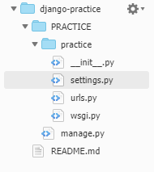
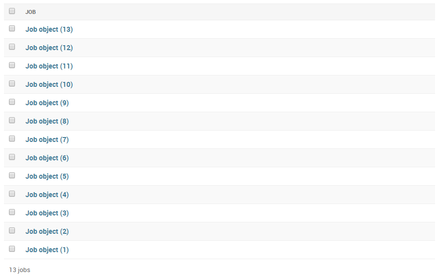
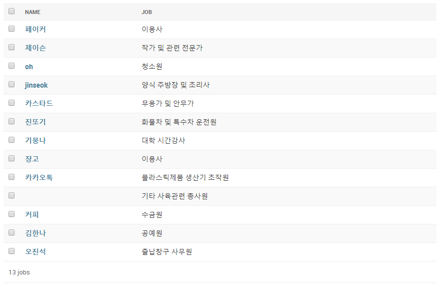
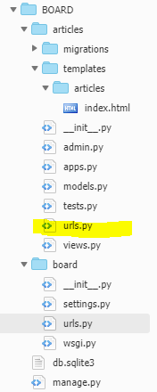
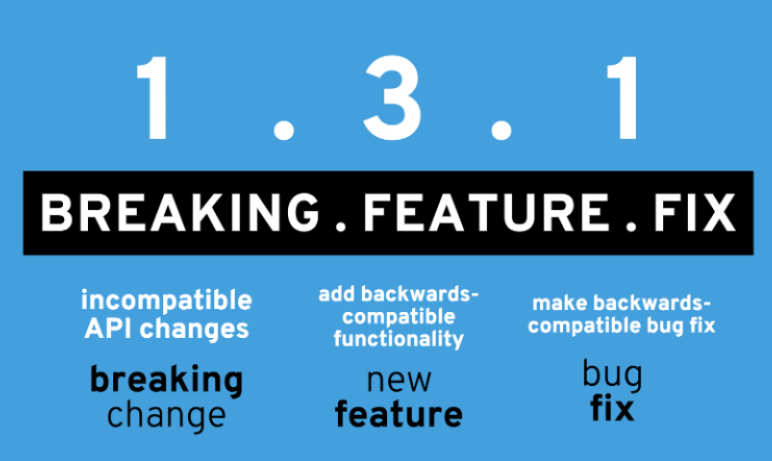

# Django

## 특징

### MTV


* Model : 데이터를 관리

* Template : 사용자가 보는 화면

* View : 중간 관리자

## 프로젝트

### 프로젝트 생성 및 환경 설정

* pyenv 설치

  pyenv는 현업에서 python version이 다 다를 가능성이 높기 때문에 version을 관리하기 쉽게 도와줌

  폴더별로 python version을 설정해줄 수 있음

```sh
git clone https://github.com/pyenv/pyenv.git ~/.pyenv
echo 'export PYENV_ROOT="$HOME/.pyenv"' >> ~/.bashrc
echo 'export PATH="$PYENV_ROOT/bin:$PATH"' >> ~/.bashrc
echo -e 'if command -v pyenv 1>/dev/null 2>&1; then\n  eval "$(pyenv init -)"\nfi' >> ~/.bashrc
exec "$SHELL"

git clone https://github.com/pyenv/pyenv-virtualenv.git $(pyenv root)/plugins/pyenv-virtualenv
echo 'eval "$(pyenv virtualenv-init -)"' >> ~/.bashrc
exec "$SHELL"
```

```sh
pyenv install 3.6.7
pyenv global 3.6.7
```

```sh
mkdir TEST
cd TEST
pyenv virtualenv 3.6.7 test-venv
# pyenv야 가상환경을 설정할건데 버전은 3.6.7로 해주고 이름은 test-venv로 붙여줘
pyenv local test-venv 
# 현재 폴더를 test-venv 가상환경으로 설정해줘
pip install django
# django를 설치하는데, 가상환경 안에만 존재한다.
django-admin startproject test .
# django project 시작
```



* \__init__.py : 건드릴 일 없다.
* \__settings__.py, \____url.py__ : 주로 건드림
* wsgi.py : 배포할 때 건드림

```sh
python manage.py runserver 0.0.0.0:8080 # 서버 실행
```

settings.py 에서 `ALLOWED_HOSTS` 뒤에 배포주소(ex :  ` ['django-practice-gstjs.c9users.io']`)를 써줘야 에러가 안난다.

```python
# settings.py에서
TIME_ZONE = 'Asia/Seoul' # 시간 변경
LANGUAGE_CODE = 'ko-kr' # 언어 변경
```

### Application 제작

Django-project 안에 여러 가지 application이 있는 형태

```sh
python manage.py startapp pages # application 생성
```

application을 생성하고나서 settings.py에서 INSTALLED_APPS에 생성한 application을 추가해준다. ','를 추가해준다. (trailing comma)

view가 가장 중요하기 때문에 views.py 먼저 조진다.

```python
def index(request):
    return render(request, 'index.html')

# @app.route('/') -> urls.py
# def index():
#     return render_template('index.html')

# 위는 django 아래는 flask
```

```python
# urls.py
from django.contrib import admin
from django.urls import path
from pages import views

urlpatterns = [
    # path(url, 처리해야할 view)
    path('index/', views.index),
]
```

```python
# 변수를 전달하고 싶을 때
context = {'msg': "hello",'name': "John"}
return render(request, 'index.html', context)
```

```html
<h1>
    First Django!!
</h1>
<h2>
    {{msg}}
</h2>
<h3>
    {{name}}
</h3>
```

```python
# form 이용
word = request.GET.get('word')
```

```html
<!-- base.html -->
<!DOCTYPE html>
<html lang="en">
<head>
    <meta charset="UTF-8">
    <meta name="viewport" content="width=device-width, initial-scale=1.0">
    <meta http-equiv="X-UA-Compatible" content="ie=edge">
    <title></title>
</head>
<body>
    
    
    
</body>
</html>
```

> django - base.html
>
> flask - layout.html

### Model 조작

- django ORM을 이용한 DB 조작

```python
# models.py
# Create your models here.
class Article(models.Model):
    title = models.TextField()
    content = models.TextField()
```

```sh
python manage.py makemirations
python manage.py migrate
python manage.py sqlmigrate application table
python manage.py shell # django의 현 상태를 지닌 shell 띄우기
python manage.py dbshell # sql shell 띄우기
# migration을 만드는 이유
# git의 commit과 비슷하다
# 버전을 쉽게 관리할 수 있다. 원하는 부분으로 롤백 할 수 있다.
```

```python
from articles.models import Article
a = Article(title="happy", content="hacking")
a.save()
Article.objects.all()
# 출력 format이 마음에 안 들 때, class에서 __repr__ 변경
# <QuerySet [제목: happy, 내용: hacking, 제목: 와 여기서도 글이 써진다!!, 내용: 쟝고 분노의 추적자]>

Article.objects.all()[0]
# 제목: happy, 내용: hacking

Article.objects.all()[1]
제목: 와 여기서도 글이 써진다!!, 내용: 쟝고 분노의 추적자

len(Article.objects.all())
# 2

for a in Article.objects.all():
...     print(a)
# Article object (1)
# Article object (2)
# 위를 변경하기 위해서는 __str__ 함수 정의

for a in Article.objects.all():
...     a
# 제목: happy, 내용: hacking
# 제목: 와 여기서도 글이 써진다!!, 내용: 쟝고 분노의 추적자

Article.objects.filter(title="happy").all()
# <QuerySet [제목: happy, 내용: hacking]>

Article.objects.filter(content="hacking").first()
# 제목: happy, 내용: hacking

Article.objects.filter(content="hacking").count()
# 1

Article.objects.get(pk=1)
# 제목: happy, 내용: hacking

Article.objects.get(id=1)
# 제목: happy, 내용: hacking

Article.objects.get(title="happy")
# 제목: happy, 내용: hacking

a = Article.objects.get(id=1)
a.content = "Thursday"
a.save()
Article.objects.get(id=1)
# 제목: happy, 내용: Thursday

Article.objects.order_by('id').all()
# <QuerySet [제목: happy, 내용: Thursday]>

Article.objects.create(title="hey", content="create")
# 제목: hey, 내용: create
        
Article.objects.all()
# <QuerySet [제목: happy, 내용: Thursday, 제목: title test, 내용: content test, 제목: hey, 내용: create]>
# save 방식으로 하는 것 추천

Article.objects.order_by('id').all()
# <QuerySet [제목: happy, 내용: Thursday, 제목: title test, 내용: content test, 제목: hey, 내용: create]>
Article.objects.order_by('-id').all()
# <QuerySet [제목: hey, 내용: create, 제목: title test, 내용: content test, 제목: happy, 내용: Thursday]>
```

### Admin 관리

```python
# admin.py
from .models import table

# Register your models here.
admin.site.register(table)
```



```sh
python manage.py createsuperuser
```

```python
class JobAdmin(admin.ModelAdmin):
    list_display = ('name', 'job')
    
admin.site.register(Student, StudentAdmin)
```



* descriptive programming (modern framework의 특징)

### static 설정

```html
<!-- base.html -->



<!DOCTYPE html>
<html lang="en">
<head>
    <meta charset="UTF-8">
    <meta name="viewport" content="width=device-width, initial-scale=1.0">
    <meta http-equiv="X-UA-Compatible" content="ie=edge">
    <title>Document</title>
    <link rel="stylesheet" href="">
</head>
<body>
    
    
</body>
</html>
```

templates 폴더와 같은 level에 static 폴더 생성

### 게시판 프로젝트

```sh
pip install ipython django-extensions
# django-extensions 가 깔려 있고 ipython이 깔려 있으면
# shell을 ipython으로 바꿔준다.
```

```python
# INSTALLED_APPS에 추가
'django_extensions',
```

#### 표준 CRUD url 구성

**RESTful (API)**

* R
  * /articles/ 	- list
  * /articles/1      - detail
* C
  * /articles/new 	- new(작성)
  * /articles/create     - create(DB 저장)
* U
  * /articles/1/edit     - edit
  * /articles/1/update     - update
* D
  * /articles/1/delete 		- delete

url에 articles가 계속해서 반복 - sub 문지기 생성

해당하는 app 안에 urls.py 생성



```python
# articles/urls.py

from django.urls import path
from . import views

urlpatterns = [
    path('', views.index),
]
```

```python
from django.contrib import admin
from django.urls import path, include # import include
from articles import views

urlpatterns = [
    path('admin/', admin.site.urls),
    path('articles/', include('articles.urls')), 
    # include /articles/urls.py
]
```

#### CREATE

```python
# views.py
from django.shortcuts import render, redirect
from  .models import Article

# Create your views here.   
def new(request):
    return render(request, 'articles/new.html')
    
def create(request):
    # DB에 저장
    # title = request.GET.get('title')
    # content = request.GET.get('content')
    # GET 방식으로 CREATE 수행 X
    
    title = request.POST.get('title')
    content = request.POST.get('content')
    
    article = Article(title=title, content=content)
    article.save()
    
    return redirect('/articles/')
```

```html
<!-- POST 방식으로 변환 -->
<!-- new.html -->
<h1>게시글 작성</h1>
<form action="/articles/create/" method='POST'>
    제 목 : <input type="text" name="title"/>
    내 용 : <input type="text" name="content"/>
    <input type="submit" value="Submit"/>
     <!-- django 에서 발행하는 csrf_token-->
    <!-- 도장처럼 csrf_token이 찍혀있어야 create 접근 가능-->
</form>
```

``` python
# urls.py
from django.urls import path
from . import views

urlpatterns = [
    path('', views.index),
    path('new/', views.new),
    path('create/', views.create),
]
```

#### READ

```python
# views.py
def index(request):
    # articles = Article.objects.all()
    articles = Article.objects.order_by('-id').all()
    # 역순
    context = {
        'articles': articles,
    }
    return render(request, 'articles/index.html', context)

def detail(request, article_id):
    article = Article.objects.get(id=article_id)
    context = {
        'article' : article,
    }
    return render(request, 'articles/detail.html', context)
```

```python
# urls.py
urlpatterns = [
	path('<int:article_id>/', views.detail),
]
```

```html
<h1>게시글</h1>
<h3>{{ article.title }}</h3>
<p>{{ article.content }}</p>

<a href="/articles/">돌아가기</a>
```

#### UPDATE

#### DELETE

#### URL rename

```python
# urls.py

from django.urls import path
from . import views

urlpatterns = [
    path('', views.index, name="index"),
    path('new/', views.new, name="new"),
    path('create/', views.create, name="create"),
    path('<int:article_id>/', views.detail, name="detail"),
    path('<int:article_id>/edit/', views.edit, name="edit"),
    path('<int:article_id>/update/', views.update, name="update"),
    path('<int:article_id>/delete/', views.delete, name="delete"),
]
# name 별명 같은 것
```

```python
return redirect('index') # redirect를 이와 같이 쓸 수 있음
```

```html
<a href="">수 정</a>
<a href="">삭 제</a>
<a href="">돌아가기</a>
<!-- 변수는 차례대로 뒤에 붙여주면 됨 -->
```

#### etc pages

models 같은 것들이 필요없고 단일 페이지만 존재하는 것들을 주로 pages라는 app으로 만들어서 관리함(선생님 스타일)

render할 때, 모든 앱들을 똑같은 레벨에서 검사

동일한 파일이 있다면, INSTALLED_APPS에서 먼저 써져 있는 app의 template을 render한다. 

하지만 헷갈리므로, templates 폴더 안에 app 이름과 같은 폴더를 만들어주고 그 안에서 template을 관리하도록 한다.

그리고 render에서 명시적으로 어느 app 안에 있는 지 써주도록 한다.

templates에 있는 파일은 어떤 app에서도 공유한다. 

'base.html' 같은 중립 파일은 project 폴더 아래 templates 폴더를 생성해서 넣어준다.

project 폴더 아래에서 templates 폴더를 관리할 경우 settings.py에서 명시를 해줘야 한다.

 ```python
# settings.py

TEMPLATES [
    # ...
    'DIRS': [os.path.join(BASE_DIR, 'board', 'templates')],
    # ...
]
# os.path.join을 쓰는 이유
# os에 맞게 경로를 생성해준다.
 ```


legacy code

semantic versioning



- breaking

  앞의 버전과 호환이 안되는 부분이 있다.

- feature

  이전 버전에 있는 것을 쓸 수 있지만, 새로 나온 것들이 있다.

- fix

  bug를 고친 것