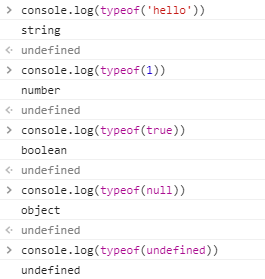

# JavaScript

## About JS

* **Browser를 조작하기 위해 만든 언어**
* Computer를 조작하기 위해 만든 언어 : Python, C, Java 등등
* Seamless(봉제선이 없는 == 매끄러운) 유저 경험을 만들어 주기 위해서 필요함!
* 요청을 보냈지만 새로운 요청을 보내지 않은 것처럼 만들 수 있음.
* 공식문서가 없다. 
* [JavaScript MDN](<https://developer.mozilla.org/ko/docs/Web/JavaScript>)
* JavaScript는 하나의 언어를 뜻하는 것이 아님
* ECMA에서 만든 JavaScript 표준에 따라 각 회사마다 engine을 만듦
  * Chrome V8
  * Firefox Spider Monkey
  * Safari JavaScriptCore
  * IE Chakra
* JavaScript의 주요 기능
  * Browser = BOM(Browser Object Model) 조작
  * HTML = DOM(Document Object Model) 조작


## Practice

* ctrl + shift + j 키를 누르면 console창에서 JavaScript 코드를 작성해볼 수 있다.

* 주어.동사 느낌

  * window.print()
  * window.innerWidth()

* commenting

  * oneline

    //

  * multilne

    /* */

* 다양한 명령어

  ```javascript
  document.write('<h1>제목입니다.</h1>')
  document.write('<p>아몰랑</p>')
  document.write('<h1>제목입니다.</h1>')
  document.write('<p>아무말아몰랑</p>')
  
  ptag = document.querySelector('p')
  document.querySelector('p').innerText = '몰랑몰랑'
  
  ptag.innerText = '진짜몰랑'
  ```
## Data Type(Primitive)

* string

* number

* boolean

* null

  추후에 들어온 원시자료형이기 때문에 object로 표현됨

* undefined

* symbol

  




위의 6개의 원시자료형을 제외하고는 전부 사용자 정의자료형(Array, Function, Object)이다.

**모든 것이 객체다!!!!**(원시빼고)


## Declarations

### var

* function-scoped

### let

* block-scoped
* 다시 설정이 필요할 때

### const

* block-scoped
* 다시 설정이 필요하지 않을 때


## 저장

1. 무엇
   * Data Type
     * 변수
     * array(list in python)
     * object(dictionary in python)
     * etc..
2. 어디에
3. 어떻게


## 조작

### 조건


### 반복


## method

### Array

### Object

```javascript
const student = {'name': 'john', 'age': 20, 'isMale': true}

student['name']
==> 'john'

student.name
==> 'john'

const student2 = {name: 'john', age: 20, isMale: true}
// 위의 코드와 같다.
```


## Function

1. function 키워드를 통해 함수를 정의

   ```js
   function sum(a, b) {
       return a + b;
   }
   ```

2. 익명함수를 선언 => 변수에 할당 (중요)

   ```js
   let sum = function(a, b) {
       return a + b;
   }
   ```

3. ES6 Arrow Function

   ```js
   let sum3 = (a, b) => {
       return a + b
   }
   
   let sum3 = (a, b) => a + b
   
   let sum3 = a => a + 2
   
   // JS에서는 함수에 함수를 전달하는 경우가 많기 때문에
   // 변수명 같은 것들을 축약할수록 좋음
   // 그래서 나온 것이 JS Arrow Function
   ```

### hoisting?

### 함수 활용

#### 배열 순회

```js
let menu = ["짜장면", "짬뽕", "쌈밥", "김밥"]

// 1. for 문을 통해 배열을 순회
for (let i = 0; i < menu.length; i++) {
    console.log(menu[i])
    
// 2. forEach() 메서드를 통해 순회
menu.forEach(function(food){
    console.log(food)
})
```

```js
const posts = [
    {id: 1, title: "안녕"},
    {id: 2, title: "자바스크립트"},
    {id: 3, title: "브라우저 조작"},
]

// foreach를 통해 순회를 하여 id가 2번인
// post를 찾으세요.

posts.forEach(function(post){
    if (post.id === 2) {
        console.log(post.title);
    }
})
/*
JS에서는 등호를 3개 써준다.
*/
```

```js
// 아재 판독기
const age = prompt("나이를 말해줘")

// 만약 30 초과이면 => 아재
// 20 초과이면 => 학식
// 8 초과이면 => 급식
// else => 이유식

if (age > 30) {
    alert("아재네")
}
else if (age > 20) {
    alert("학식이네")
}
else if (age > 8) {
    alert("급식이네")
}
else {
    alert("이유식이네")
}

// prompt로 들어오는 input은 string인데 비교가 된다?
// type coercion(== implicit coercion[type casting]) 이 일어나서 가능!!
// 같은 걸 물어볼 때(==)
'34' == 34 // true
// ==는 잊어버리자..
```

```js
const images = [
    {height: 10, width: 30},
    {height: 20, width: 90},
    {height: 50, width: 40},
]

// images에 들어가 있는 이미지들의
// 넓이를 구해 area에 넣으세요.
const area = []
images.forEach(image => area.push(image.height * image.width))

const numbers = [1, 2, 3, 4, 5, 6]
let squaredNumbers = []

// 1. squaredNumber를 numbers의 요소들을
// 제곱을 한 숫자들의 배열로 만든다.
// (for 사용)

// 2. map() 사용
squaredNumbers = numbers.map(function(number) {return number * number}) // map에는 무조건 return 값이 있어야 한다.
console.log(squaredNumbers)
```

```js
let users = [
    {id: 1, username: 'tony'},
    {id: 2, username: 'steve'},
    {id: 3, username: 'thor'},
    {id: 4, username: 'tony'},
]

// find
const tony = users.find(function(user){
    return user.username === 'tony'
})

// filter
const tonys = users.filter(function(user){
    return user.username === 'tony'
})

// reject
function reject(array, func) {
    const result = []
    array.forEach(function(i){
        if (!func(i)) {
            result.push(i)
        }
    })
    return result
}
// 강사님
function reject(array, func) {
    return array.filter(function(user) {
        return !func(user)
    })
}
// => 해당하는 조건이 아닌 요소들만 리턴하는 함수
const not_tonys = reject(users, function(user){
    return user.username === 'tony'
})
console.log(not_tonys)

// every
const every_tony = users.every(function(user) {
    return user.id < 5
})
console.log(every_tony)
// 모든 요소들을 순회하면서 전부 조건에 만족하면 true, 아니면 false

// some
const some_tony = users.some(function(user){
    return user.username === 'tony'
})
console.log(some_tony)
// 일부 요소가 조건에 만족하면 true, 아니면 false
```


## google dino example

```html
<!DOCTYPE html>
<html lang="en">
<head>
    <meta charset="UTF-8">
    <meta name="viewport" content="width=device-width, initial-scale=1.0">
    <meta http-equiv="X-UA-Compatible" content="ie=edge">
    <title>Dooly</title>
    <style>
        .bg {
            background-color: #F7F7F7;
            display: flex;
            justify-content: center;
            align-items: center;
            min-height: 100vh;
        }
    </style>
</head>
<body>
    <div class="bg">
        
    </div>
    <script src="app.js"></script>
</body>
</html>
```

```js
// app.js
const dou = document.querySelector('#dou')
console.log(dou)

dou.addEventListener('click', function(e){ // e : event 축약
    console.log('호잇')
})
// eventlistener('event의 이름', 함수)
```

